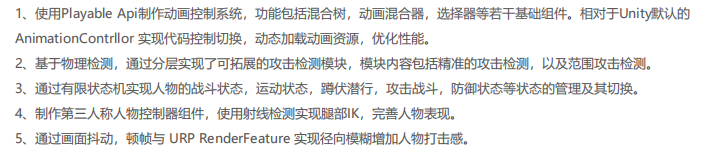

## 第三人称动作游戏项目细节说明：



### Playable API 制作的 AnimationController

问题：

在输出结点与实际结点相连时候，在不给结点设置enable()的情况下，依旧会播放动画。我通过一个root 组件（功能是启用它就启用全部的结点，禁用它就禁用全部的子节点）来割开输入结点与实际结点。

大体上分为三层为 组件层（定义了一系列的基础组件包括混合树，动画选择器，动画混合器等等），控制层调用基础组件的一些方法，与一些数据结构对性能进行优化（比如使用字典优化通过，字符串访问），最上面一层主要是数据层的一些方法包括实现使用 ScriptOcject 定义的一些动画数据进行动态的加载。调用的是控制层的一些方法。

**基础框架：**

AnimAdpter 继承于 PlayableBehaviour，在PlayableBehaviour 的生命周期中（包括Init 初始化，PrepareFrame 每帧前，OnGraphStop 停止时）嵌套执行 AnimBehaviour中的函数。

**动画片段播放的实现：**

使用`AnimationClipPlayable` 根据 graph 与 animationClip 创建可播放项。

**Root 根节点的实现：**

Root 结点主要实现了结点开启时与关闭时，遍历其全部的输入接口，让其子节点开启，主要用于辅助

```
for (int i = 0; i < m_adapterPlayable.GetInputCount(); i++)
{
     AnimHelper.Enable(m_adapterPlayable.GetInput(i));
}
```

**AnimSelector：**

currentIndex 当前播放序列

 List<float> m_enterTimes; 

 List<float> m_clipLengths;

根据动画片段创建，AnimUnit 类并将其添加到输入端口。

使用`AnimationMixerPlayable` 对动画进行混合与切换

其中最重要的 Seletor( ) 方法在动画片段播放结束之后执行。根据需求不同去重写比如动画序列播放，动画随机播放。

**Mixer**

`TransitionTo` 动画切换函数主要是对切换速度，动画片段时间进行设置，向递减序列中添加元素，以及对于特殊情况进行处理(切换的目标就是当前目标，切换的目标就是正在切换的目标)。

在每帧中对递减序列的动画权重进行减少。当前正在切换中的动画权重等于1- 递减动画权重之和

    private List<int> m_declinedIndex;

**BlendTree**

在对应位置x,y改变后使用曼哈顿距离。AnimationMixerPlayable做动画权重的改变。

```
for (i = 0; i < m_clipCount; i++)
{
    m_total += m_datas[i].output;// output 为1/曼哈顿距离
}
for (i = 0; i < m_clipCount; i++)
{
    m_mixer.SetInputWeight(i, m_datas[i].output / m_total);
}
```

**JLAnimController**

动画控制器：

根节点为一个Mixer动画混合器组件，它的输入为若干定义的动画组件。将全部数据使用Dir 对查询操作进行加速（要去为一个混合树去赋值，就使用字典快速进行获取），增加，移除动画组件的方法。

**PlayerAnim**

AnimController 动画控制器与动画数据的一个结合，资源加载模块（加载的是SO），Transition（动画切换组件）

### IK 原理

总述**IK的原理：**

通过animator 这个组件的骨骼获取双脚位置，使用射线检测（向下）获取地面的法向量与位置。通过这些信息，我们获得脚的目标旋转与位置。然后根据差值的大小看是否要移动臀部，最后在动画中设置权重。（改进）在过程中为保证流畅使用了上一帧位置做一个插值。（小问题）速度过快发生错误。

**IK 的实现：**

`FixedUpdate()` 主要做脚部位置的解算

* 第一步先将双脚的位置获取（需要向上做一段偏移）。

* 从双脚的位置向下做射线检测，获取射线检测击中竖直方向上的位置与法向量

* 目标位置的x,z 不变但y 变成 feetOutHit.point.y + pelvisOffset，旋转主要是根据脚部触地点的法线方向，计算出一个新的旋转，并将其应用到当前物体的旋转上

`OnAnimatorIK()` 主要是做骨盆位置偏移，IK，位置，旋转，权重的设置

* `MovePelvisHeight` 移动臀部位置的原因：防止脚的高低差过大而导致的脚悬空。


* 通过计解算的位置进行偏移。

### 人物状态机

人物状态机的基本交互是过下面的这个去完成的

**ThirdPersonCharacter.cs** 

第三人称角色控制器使用 Rigidbody 实现：

* `Move(Vector3 move, bool crouch, bool jump, ref float forwardAmount, ref float turnAmount)` Move 函数根据目标的方向向量做人物的移动
* `ScaleCapsuleForCrouching` 随人物动作变化碰撞体

**状态机**

` Dictionary<Type, StateNode> nodes = new();`

使用字典将状态映射到状态结点上，状态结点数据包括`State` 状态转换方法。这样实现了当前状态向目标状态的转变。

```C++
class StateNode {
    public IState State { get; }
    public HashSet<ITransition> Transitions { get; }
}
```

 `HashSet<ITransition> anyTransitions = new();`

使用`Set `去实现全局的状态转变。

**状态转换方法**

遍历全部的转化，看看是否符合

```C++
ITransition GetTransition() {
    foreach (var transition in anyTransitions)
        if (transition.Condition.Evaluate())
            return transition;

    foreach (var transition in current.Transitions)
        if (transition.Condition.Evaluate())
            return transition;

    return null;
}
```

状态逻辑图


**条件类**

继承`IPredicate` 底层接口中 `Evaluate` 的执行方法，该执行方法返回bool 类型的变量进行判断，（由于在stateMachine 持有的是接口）后期可以对条件类进行拓展。实现了当前状态到目标状态的转换与全局转换

**状态类**

继承`IState` 接口中的 `        void OnEnter();``void Update();``void FixedUpdate();``void OnExit();`

然后通过通过 Mono 嵌套执行当前状态接口方法实现。

### 物理检测

物理检测分为三层：

最底层：DetectionBase 基类，基类中定义若干方法，最重要的是CheakHit( )，用于返回当前检测类检测到的物体。通过继承检测基类来重写相应方法，来实现不同的检测方式，我实现了精准攻击检测和范围攻击检测两种。

中间层：DetetionHepler （检测帮助）类，对CheakHit 返回的物体做筛选。比如上一帧和当前帧都返回相同的物体肯定不能处理两次，需要将已经处理过的数据 

- 检测原点


**tuple**

伤害检测部分主要分为 tuple - 单个物理检测点，物理检测的最基本逻辑是：记录上一帧位置与当前帧位置，由上一帧位置向当前位置做射线检测，返回命中物体的列表。 将射线检测的结果存储在下面。


`public List<Transform> HitCheck()`

**JL_CombatSystem_TupleManager**

由于我们的Tuple元组只是单个点检测，为了实现比较大范围的检测，我们通常包含多个检测元组，所以对于一种武器我们使用一个TupleManager去管理。

**检测部分：**

* `List<Transform> _Shields_Hit` 用来排除已经做完打到盾牌上的物体

* `List<Transform> _Used_Targets ` 用来排除已经做完处理的全部物体

* `bool HitFlesh,HitWall,HitShield` 当前帧是否对检测到的物体进行处理

**检测到防御盾牌**

```C#
_markers[i]._target[t].tag == _shieldTag // 核心
```

**检测攻击到敌人**

更新 `_Used_Targets` ，

**攻击到墙壁**

检测处理部分：

`TargetRawHealth` 获取目标的战斗系统中的血量值，`ApplyDamage(_damage)` 调用伤害函数，实例化例子特效。


**JL_CombatSystem_Health 与 Hitbox**

对血量做一些封装，同时为了保证碰撞体的精准性，我们根据 Hitbox 去返回他的 `Health`,手臂和腿都是一个碰撞体并放了Hitbox脚本，然后在伤害检测的时候都变成返回 Health。

**JL_CombatSystem_AnimationEvents**

主要是与动画系统交互，和未来的武器切换功能准备的。

我们会在需要碰撞检测的时候开启，`EnableMarkers` 不需要进行检测的时候进行关闭。防止说一些奇怪的碰撞检测比如走路的时候碰到刀了掉血。

### 打击感

检测系统查询到目标的生命组件，将攻击数据传递进来进行处理。

顿帧方法：通过调用自定义动画控制系统的 SetTimeScale( ) 函数，SetTimeScale函数，是一个协程

相机抖动方法：GameManager.instance(单例) 的GameCamera 的Doshake 方法。DoShake 方法，通过传递攻击数据来。

使用Unity URP 管线下的RenderFature ScriptableRendererFeature 重写`public override void Execute`执行`override void Create()`创建 `override void AddRenderPasses`添加渲染事件

Unity RenderFature 有一点想DX12 获取 Camera RT Descriptor(描述符)，通过 CommandBufferPool 获取CommandBuffer 图形命令列表。CommandBuffer 将数据传给Shader

Shader 实现，然后沿着这些（聚焦点 - 屏幕坐标 ）方向Dir，隔一段距离取几个像素，混合起来

## DX12 渲染器

### 描述符分配器

主要是针对 CPU 可见描述符与 GPU 可见性描述符两种来进行的设计

CPU 部分：

采用空闲链表进行内存管理：这部分的内存管理通过三个类来完成，分别是描述符分配器，描述符分配页面，分配对象三个类。

**DescriptorAllocator**

（分配器）持有数据，提供了接口，进行内存的管理，这些接口嵌套调用类中的`vector<DescriptorAllocatorPage>>` 中的分配方法。

**DescriptorAllocatorPage** 

内部包含实际的数据（比如`DescriptorHeap`），与分配方法（空闲链表）

    // 描述符堆
    Microsoft::WRL::ComPtr<ID3D12DescriptorHeap> m_d3d12DescriptorHeap;
    // 描述符类型
    D3D12_DESCRIPTOR_HEAP_TYPE m_HeapType;
    // 用于表示CPU上的描述符句柄（descriptor handle）
    CD3DX12_CPU_DESCRIPTOR_HANDLE m_BaseDescriptor;

分配方法：使用`multimap<SizeType, FreeListByOffset::iterator>;` 对空间大小与空闲块信息做了一个映射，采用最佳适应算法（`map.lower_bound()`时间复杂度 `logN`）

**DescriptorAllocation** 

用于表示描述符堆中的单个分配。存储DescriptorHeap 分配之后的结果。主要是基地址，描述符数量，偏移。

GPU部分：

**DynamicDescriptorHeap**

该类 CPU 可见描述符提供暂存区域，当在命令列表上调用`Draw`时，这些描述符将提交到 GPU 可见描述符堆

是分配 GPU 可见描述符，这些描述符用于将 CBV、SRV、UAV 和采样器绑定到 GPU 管道以进行渲染或计算调用。

### ResourceStateTracker

资源状态转换器主要实现了，**多个资源转换屏障提交**，减少性能消耗与**资源状态的动态记录**。

数据实现：

```C++
map<Resource*,ResourceState> GlobalResourceState;
std::vector<D3D12_RESOURCE_BARRIER> ResourceBarriers;

struct ResourceState
{
    D3D12_RESOURCE_STATES State;
    std::map<UINT, D3D12_RESOURCE_STATES> SubresourceState;
};
```

资源状态的动态记录主要是因为DX12提交资源屏障需要资源的 `Before` 状态（不好获取）和`After` 状态（好获取），通过 map 这个数据结构，将资源的Resource*(指针)与Resource状态进行映射，这样就可以通过资源的Resource 指针获取Before。

多个资源转换屏障提交通过 `vector<D3D12_RESOURCE_BARRIER>` 实现，在资源屏障提交时，使用vector 暂存然后一块提交。

`ResourceStateTracker` 如何插入到龙书系统中的，是在Resource 类（比如Buffer,Texture）创建时，添加到map 中记录其状态，在需要调用资源转换的时候调用资源动态转换类的转换方法。将屏障添加到待提交队列中，并更新map 的状态。

`ResourceTracker`

对数据读写的时候都有

* 在全景图转`CubeMap` 使用的是`ComputerShader`

```C++
TransitionBarrier(stagingTexture, D3D12_RESOURCE_STATE_UNORDERED_ACCESS);
```

* 对`RenderTarget` 的数据进行清除

```C++
void CommandList::ClearTexture( const Texture& texture, const float clearColor[4])
{
    TransitionBarrier(texture, D3D12_RESOURCE_STATE_RENDER_TARGET);
    m_d3d12CommandList->ClearRenderTargetView(texture.GetRenderTargetView(), clearColor, 0, nullptr );
    TrackResource(texture);
}
```

* 绘制到`Render Target` 复制到`backBuffer`

```C++
TransitionBarrier( dstRes, D3D12_RESOURCE_STATE_COPY_DEST );
TransitionBarrier( srcRes, D3D12_RESOURCE_STATE_COPY_SOURCE );
```

* 深度缓冲区变成写入模式

```C++
void CommandList::ClearDepthStencilTexture( const Texture& texture, D3D12_CLEAR_FLAGS clearFlags, float depth, uint8_t stencil)
{
    TransitionBarrier(texture, D3D12_RESOURCE_STATE_DEPTH_WRITE);
    m_d3d12CommandList->ClearDepthStencilView(texture.GetDepthStencilView(), clearFlags, depth, stencil, 0, nullptr);

    TrackResource(texture);
}
```

* `RenderTarget` Copy到`BackBuffer`  后台缓冲区

* ` CopyBuffer( vertexBuffer, numVertices, vertexStride, vertexBufferData );` 
  
  顶点缓冲区的复制，通过上传堆复制数据

* `CopyBuffer( indexBuffer, numIndicies, indexSizeInBytes, indexBufferData ); ` 
  
  索引缓冲区的复制

### upLoadBuffer

`upLoadBuffer`主要是针对经常变动的常量资源使用的，内部重点实现了线性内存分配器（获取空间不释放，除非该类销毁）。

在DX12 中要使用上传堆对资源进行上传需要CPU地址与GPU 虚拟地址。 核心是实现线性分配器，线性分配器的每个内存页存储两个指针（基指针和页中的当前偏移量）。 每一次调用当前页的分配空间函数。并将分配的地址空间（CPU地址与GPU 虚拟地址）返回。

选择线性内存分配器的原因是：

* 常量资源，基本不涉及回收
* 使用内存分配器，防止每帧都创建资源。

### Mesh

数据是 `    VertexBuffer m_VertexBuffer;IndexBuffer m_IndexBuffer;`两种DX12 中的数据对象，各种图形的创建（正方体，平面，长方体，球体）基本上的流程是龙书中为将顶点与向量放入索引缓冲与顶点缓冲中。然后初始化（创建资源那一套：获取buffer 大小（bufferSize），然后`CreateCommittedResource`创建承诺资源，`ResourceStateTracker`添加到动态资源全局跟踪映射中，创建资源描述符）。

### Shader 光照模型

`PBR Shader`

```C++
#version 330 core
out vec4 FragColor;
in vec2 TexCoords;
in vec3 WorldPos;
in vec3 Normal;

// material parameters
uniform sampler2D albedoMap;
uniform sampler2D normalMap;
uniform sampler2D metallicMap;
uniform sampler2D roughnessMap;
uniform sampler2D aoMap;

// lights
uniform vec3 lightPositions[4];
uniform vec3 lightColors[4];

uniform vec3 camPos;

const float PI = 3.14159265359;
// ----------------------------------------------------------------------------
// Easy trick to get tangent-normals to world-space to keep PBR code simplified.
// Don't worry if you don't get what's going on; you generally want to do normal 
// mapping the usual way for performance anyways; I do plan make a note of this 
// technique somewhere later in the normal mapping tutorial.
vec3 getNormalFromMap()
{
    vec3 tangentNormal = texture(normalMap, TexCoords).xyz * 2.0 - 1.0;

    vec3 Q1  = dFdx(WorldPos);
    vec3 Q2  = dFdy(WorldPos);
    vec2 st1 = dFdx(TexCoords);
    vec2 st2 = dFdy(TexCoords);

    vec3 N   = normalize(Normal);
    vec3 T  = normalize(Q1*st2.t - Q2*st1.t);
    vec3 B  = -normalize(cross(N, T));
    mat3 TBN = mat3(T, B, N);

    return normalize(TBN * tangentNormal);
}
// ----------------------------------------------------------------------------
float DistributionGGX(vec3 N, vec3 H, float roughness)
{
    float a = roughness*roughness;
    float a2 = a*a;
    float NdotH = max(dot(N, H), 0.0);
    float NdotH2 = NdotH*NdotH;

    float nom   = a2;
    float denom = (NdotH2 * (a2 - 1.0) + 1.0);
    denom = PI * denom * denom;

    return nom / denom;
}
// ----------------------------------------------------------------------------
float GeometrySchlickGGX(float NdotV, float roughness)
{
    float r = (roughness + 1.0);
    float k = (r*r) / 8.0;

    float nom   = NdotV;
    float denom = NdotV * (1.0 - k) + k;

    return nom / denom;
}
// ----------------------------------------------------------------------------
float GeometrySmith(vec3 N, vec3 V, vec3 L, float roughness)
{
    float NdotV = max(dot(N, V), 0.0);
    float NdotL = max(dot(N, L), 0.0);
    float ggx2 = GeometrySchlickGGX(NdotV, roughness);
    float ggx1 = GeometrySchlickGGX(NdotL, roughness);

    return ggx1 * ggx2;
}
// ----------------------------------------------------------------------------
vec3 fresnelSchlick(float cosTheta, vec3 F0)
{
    return F0 + (1.0 - F0) * pow(clamp(1.0 - cosTheta, 0.0, 1.0), 5.0);
}
// ----------------------------------------------------------------------------
void main()
{        
    vec3 albedo     = pow(texture(albedoMap, TexCoords).rgb, vec3(2.2));
    float metallic  = texture(metallicMap, TexCoords).r;
    float roughness = texture(roughnessMap, TexCoords).r;
    float ao        = texture(aoMap, TexCoords).r;

    vec3 N = getNormalFromMap();
    vec3 V = normalize(camPos - WorldPos);

    // calculate reflectance at normal incidence; if dia-electric (like plastic) use F0 
    // of 0.04 and if it's a metal, use the albedo color as F0 (metallic workflow)    
    vec3 F0 = vec3(0.04); 
    F0 = mix(F0, albedo, metallic);

    // reflectance equation
    vec3 Lo = vec3(0.0);
    for(int i = 0; i < 4; ++i) 
    {
        // calculate per-light radiance
        vec3 L = normalize(lightPositions[i] - WorldPos);
        vec3 H = normalize(V + L);
        float distance = length(lightPositions[i] - WorldPos);
        float attenuation = 1.0 / (distance * distance);
        vec3 radiance = lightColors[i] * attenuation;

        // Cook-Torrance BRDF
        float NDF = DistributionGGX(N, H, roughness);   
        float G   = GeometrySmith(N, V, L, roughness);      
        vec3 F    = fresnelSchlick(max(dot(H, V), 0.0), F0);

        vec3 numerator    = NDF * G * F; 
        float denominator = 4.0 * max(dot(N, V), 0.0) * max(dot(N, L), 0.0) + 0.0001; // + 0.0001 to prevent divide by zero
        vec3 specular = numerator / denominator;

        // kS is equal to Fresnel
        vec3 kS = F;
        // for energy conservation, the diffuse and specular light can't
        // be above 1.0 (unless the surface emits light); to preserve this
        // relationship the diffuse component (kD) should equal 1.0 - kS.
        vec3 kD = vec3(1.0) - kS;
        // multiply kD by the inverse metalness such that only non-metals 
        // have diffuse lighting, or a linear blend if partly metal (pure metals
        // have no diffuse light).
        kD *= 1.0 - metallic;      

        // scale light by NdotL
        float NdotL = max(dot(N, L), 0.0);        

        // add to outgoing radiance Lo
        Lo += (kD * albedo / PI + specular) * radiance * NdotL;  // note that we already multiplied the BRDF by the Fresnel (kS) so we won't multiply by kS again
    }   

    // ambient lighting (note that the next IBL tutorial will replace 
    // this ambient lighting with environment lighting).
    vec3 ambient = vec3(0.03) * albedo * ao;

    vec3 color = ambient + Lo;

    // HDR tonemapping
    color = color / (color + vec3(1.0));
    // gamma correct
    color = pow(color, vec3(1.0/2.2)); 

    FragColor = vec4(color, 1.0);
}
```

概述：

渲染采用前向渲染，支持多光源光照。遍历常量缓冲区上传的灯光信息，设置一个总颜色，使用for循环遍历每一个光源，计算高光颜色，漫反射颜色并求和。像素着色器采用考虑了光源的能量衰减局部光照模型。

细节点包括各种光源的处理，衰减的处理。

**光照处理**

漫反射部分采用 **兰伯特模型**

```C++
Diffuse =  max( 0, dot( N, L ) ) * attenuation(衰减) * light.Color(光照颜色);
max( 0, dot( N, L ) ) 为平面法向量与光照方向点乘，取 0~1 之间的结果
```

高光部分采用 **布林冯模型**

```C++
Specular = pow(max(dot(N,(L + v).normalize),0),SpecularPower) * attenuation * light.Color;
```

**点光源**

点光源就是上面的结果

**精准光源**

精准光源是上面的结果乘一个距离中心的角度，实现中间亮两边暗的效果。

**方向光**

没有衰减

### Minmap

**加载纹理的过程：**

1. **入口函数**

```C++
void CommandList::LoadTextureFromFile( Texture& texture, const std::wstring& fileName, TextureType textureUsage )
```

2. 设置图片的格式

```C++
 texture.SetTextureUsage(textureUsage);
```

3. 通过上传堆分配资源

```C++
  ThrowIfFailed( device->CreateCommittedResource(.......));
```

4. 将其加入资源状态跟踪器中

```C++
ResourceStateTracker::AddGlobalResourceState( textureResource.Get(), D3D12_RESOURCE_STATE_COMMON );
```

5. 设置纹理类型，设置名称，创建视图
   
    texture.SetTextureUsage( textureUsage );
    texture.SetD3D12Resource( textureResource );
    texture.CreateViews();
    texture.SetName(fileName);

6. 检查其子资源的数量是否小于其描述符中的Minmap等级。如果小于Minmap 等级就生成Minmap

```C++
if ( subresources.size() < textureResource->GetDesc().MipLevels ){
    GenerateMips( texture );
}
```

### MVP 变换

**Model** 变换：

```C++
worldMatrix = scaleMatrix * rotationMatrix * translationMatrix;
```

**View** 变换：


**Project**变换：

```C++
XMMatrixPerspectiveFovLH(FOV, Ratio(距离), m_zNear(近平面距离), m_zFar(远平面距离));
```

### DX 渲染器框架相关

大体类主要是`Window`,`Application`,``Game`,三个主类

概述：

`window`

该类主要是处理Win32 窗口创建，

`Application` 

主要是一个单例类，内部持有命令队列，描述符分配器，DX设备这些数据。

```C++
static Application* gs_pSingelton = nullptr;
```

其中比较常用的方法是使用`Application::Get()`方法获取实例，然后使用其 DX设备创建资源。

`Game`

该类存储了一些实际的数据，比如几何体Mesh 信息，摄像机，光源，渲染目标，根签名这些信息。

`LoadContent` （在`Application::Run()`方法中初始化之后调用）加载场景内容，比如加载纹理，创建Mesh 数据，加载着色器，创建根签名，设置管道状态。

#### 初始化流程

`wWinMain` Win32 主程序中调用用`Application::Create()`方法创建实例，

#### 每帧执行

```C++
 pWindow->OnUpdate(updateEventArgs);
 RenderEventArgs renderEventArgs(0.0f, 0.0f);
 pWindow->OnRender(renderEventArgs);
```

`OnUpdate`  方法

```C++
m_UpdateClock.Tick(); // 计算每帧时间

pGame->OnUpdate(updateEventArgs); // 嵌套调用 Game 类的 OnUpdate 方法 
```

`OnRender` 方法

依旧是嵌套调用 `Game ` 类中的 `OnRender` 方法。

```C++
// 清空颜色缓冲区，深度模版缓冲区
commandList->ClearTexture();
commandList->ClearDepthStencilTexture();

// 上传灯光常量数据
// 点光源
PointLight(){
        PositionWS // 世界空间位置
        PositionVS // 视角空间位置
        Color    // 灯光颜色
        ConstantAttenuation // 恒定衰减
        LinearAttenuation // 线性衰减
        QuadraticAttenuation // 二次衰减
}
// 精准光
SpotLight(){
        PositionWS // 世界空间位置
        PositionVS // 视角空间位置
           DirectionWS // 世界空间方向
        DirectionVS // 视角空间方向
        Color    // 灯光颜色
        SpotAngle // 灯光角度
        ConstantAttenuation // 恒定衰减
        LinearAttenuation // 线性衰减
        QuadraticAttenuation // 二次衰减
}


// 绘制几何体
worldMatrix = scaleMatrix * rotationMatrix * translationMatrix; 
// 通过根参数传递 MVP 矩阵
commandList->SetGraphicsDynamicConstantBuffer( RootParameters::MatricesCB, matrices );
// 通过根参数传递物体材质
commandList->SetGraphicsDynamicConstantBuffer( RootParameters::MaterialCB, Material::White );
Mesh->Draw( *commandList ); // 调用Mesh 绘制方法
// Draw 过程
{
    commandList.SetPrimitiveTopology(); // 设置基元拓扑
       SetVertexBuffer(); // 设置 顶点缓冲区
    SetIndexBuffer(); // 设置 索引缓冲区
    DrawIndexed(); // 绘制
}

// 调用命令队列的 Execute 执行方法
commandQueue->ExecuteCommandList( commandList );
```

#### 材质

```C++
struct Material
{
    DirectX::XMFLOAT4 Emissive;
    //----------------------------------- (外发光)
    DirectX::XMFLOAT4 Ambient;
    //----------------------------------- (环境光照)
    DirectX::XMFLOAT4 Diffuse;
    //----------------------------------- (漫反射)
    DirectX::XMFLOAT4 Specular;
    //----------------------------------- (高光)
    float   SpecularPower;
    //----------------------------------- (高光强度)
}
```

## 迷航游戏项目细节说明


### UI 框架

**UIPanelMgr.cs 是使用单例的UI框架核心其中主要有：**

`OpenPanel<T>()` 通过下面这样的泛型方法，接受的泛型要求是继承于`PanelBase` 也就是Controller 部分，将添加脚本添加到UIGameObject，然后把对应的Controller脚本放进链表中（为了后续删除）。使用`Resource.Load` 类加载预制体，并将其实例化到UIGameObject面板下。

`ClosePanel()` 通过检索 UIPanelMgr 脚本里的链表，找到对应的 Controller 脚本，调用其 `OnClose` 方法，然后在链表中移除 Controller 脚本，并调用 Destroy( ) 方法，销毁物体。


```C#
public class UIPanelMgr : MonoBehaviour
{
    public static UIPanelMgr instance;
    //画板
    private GameObject canvas;
    //面板队列，记录已经打开的界面
    public List<PanelBase> dict;

    // 初始化部分绑定数据

    public void OpenPanel<T>() where T : PanelBase
    {
        /*为canvas添加脚本*/
        PanelBase panel = canvas.AddComponent<T>();
        panel.Init();
        if (panel.UIResourcePath != null)
            dict.Add(panel);
        Debug.Log("打开面板" + panel.UIResourcePath);
        GameObject UIPanel = Resources.Load<GameObject>(panel.UIResourcePath);
        if (UIPanel == null)
            Debug.LogError("panelMgr.OpenPanel fail, GameObject is null,skinPath = " + panel.UIResourcePath);
        panel.UIPanel = Instantiate(UIPanel);
        panel.UIPanel.transform.SetParent(canvas.transform, false);
        panel.OnShowing();
        panel.OnShowed();
    }

    public void ClosePanel(PanelBase panel)
    {
        panel.OnClosing();
        dict.Remove(panel);
        Debug.Log("关闭面板" + panel.UIResourcePath);
        Destroy(panel.UIPanel);
        Destroy(panel);
        panel.OnClosed();
    }
    //关闭所有面板
    public void CloseAllPanel()
    {
        for (int i = 0; i < dict.Count;)
        {
            ClosePanel(dict[0]);
            Debug.Log("关闭页面");
        }
    }

}
```

**PanelBase - Controller 部分定义**

控制器负责协调模型和视图之间的交互。Controller层的响应函数只是一个中间商，Controller响应函数会进一步调用View（视图层的各类函数）。

```C#
public class PanelBase : MonoBehaviour
{
    //面板路径加载
    public string UIResourcePath;
    //物体对象
    public GameObject UIPanel;
    //层级
    public UIPanelLayer layer;

    //初始化
    public virtual void Init() { }
    //开始面板前
    public virtual void OnShowing() { }
    //显示面板后
    public virtual void OnShowed() { }
    //帧更新
    public virtual void Update() { }
    //关闭前
    public virtual void OnClosing() { }
    //关闭后
    public virtual void OnClosed() { }
}
```

**UIMainView 视图层**

比如更新UI 的 Text字段。是Controller 通知

**Model 模型层**

把每一个Model 声明成为单例，其中包括，各种数据。声明了一个更新数据的事件（如下），该事件是在我们的数据值修改的时候进行调用，在 Controller 层里面将View 层的更新方法，添加到 event 事件中。


氧气值面板的例子：我们声明了氧气值 int (0 -100) ，在人物控制脚本中做水下水上的判断，对值的改变有不同的颜色与值的显示。

* Dowteen 动画

主要是定义了一个`UIAniamtions`类对基础的动画进行了封装，UI透明度变化，UI位置的移动（从上下左右四个方向到目标位置），UI大小缩放。 

### 鱼类Ai

```C#
public interface StateBase
{
    /// 进入该状态时执行 OnEntry 函数
    /// 处于该状态中执行 OnUpdate 函数
    /// 在退出状态时执行 OnExit 函数
    void OnEntry();
    void OnUpdate();
    void OnExit();
}
```

**Timer.cs**

支持定时执行某个函数，或者说是支持不定时执行某个程序，通过委托我们将要执行的函数传进来。在本个例子里面我们是根据鱼类距离人物的距离来切换状态，在状态中，改变方向与旋转。


LOD 思想： 对于越近的鱼类给予更多的计算资源。

**静止状态** 是为了对于比较远的物体，我们即让他们静止不动

**漫步状态** 对于中距离的鱼类，我们让鱼类在海洋中漫步，随机的选取方向进行游动，但是要处理的一点是如果我们不动，鱼类会逐渐游出漫步的范围。（一开始规定范围，并不会与地形进行碰撞）

**逃跑状态** 对于近距离的鱼类会逃跑，逃跑的方向是与玩家到鱼类的水平方向+随机方向。并将这个结果的数值方向降低。对于逃跑的鱼类，采用一个大的碰撞体，当与地面碰撞的时候给一个向上的速度。

```C#
// 状态
public enum FishStateType
{
    Stillness, Stroll, Escape, Death
}
// 状态机
public class FishStateMachine : MonoBehaviour
{
      // 各种鱼类数据
    public FishData fishdata;
    private StateBase CurrentState;
    public Transform PlayerPosition;
    private Dictionary<FishStateType, StateBase> States = new Dictionary<FishStateType, StateBase>();
    public FishStateMachine key;

    void Start()
    {
        // 绑定
        StateRegister(); // 状态注册
        TransitionState(FishStateType.Stillness); // 设置初始状态
    }
    void StateRegister()
    {
        States.Add(FishStateType.Stillness, new StillnessState(this));
        States.Add(FishStateType.Stroll, new StrollState(this));
        States.Add(FishStateType.Escape, new EscapeState(this));
    }
    void Update()
    {
        CurrentState.OnUpdate();
    }
    public void TransitionState(FishStateType type)
    {
        if (CurrentState != null)
            CurrentState.OnExit();
        CurrentState = States[type];
        CurrentState.OnEntry();
    }
```

### 低耦合的交互系统

人物方面的收集：

主要是通过射线检测，如果检测到物体。同时记录到`Last_Frame_Targetgameobject` 上一帧检测的物体。用来帮助observe 等的判断。`____Action ` 核心方法就是通过 `TryGetComponent` 方法尝试去获取对应这些组件然后来调用对应的这些函数。

物品方向：**组合模式**

我们主要是有收集基类，被观察基类，修理基类这三种，我们在里面定义了对应的虚方法，会在 player 那边的调用对应组件的虚方法。如果一个物体同时有屏幕对准的UI信息提示，又有被收集的信息就。将这两个脚本同时添加到这个物体上。

收集物品组件：


被观察系统组件：


修理组件：

。。。。。。。。

### 生成海底地形Mesh

[柏林噪声生成地形原文](https://zhuanlan.zhihu.com/p/643780848)

要做到对Mesh 细节的控制的真实性随机，核心思路是多次采样噪声，并给每一层给予不同的权重，最后将他们叠加起来即可。

**噪声生成部分：**

frquency 来控制高度变化的快慢，也就是对柏林噪声采样乘在拆样点里面。

贡献值 是控制采样出来的数据对最后地图结果的影响度，是乘在采样出来的结果里面。

在生成噪声矩阵完成之后对，矩阵进行映射到 0 - 1的范围中。

**网格生成部分：**

首先先声明一个类 `MeshData`

```C#
public class MeshData {
    // 顶点个数
    public Vector3[] vertices;
    // 顶点序号    
    public int[] triangles;
    public Vector2[] uvs;

    int triangleIndex;

    // 将三角形数据加入到 triangles 中
    public void AddTriangle(int a, int b, int c) {}

      // 返回对应的 Mesh
    public Mesh CreateMesh() {
        Mesh mesh = new Mesh ();
        ...
        return mesh;
    }
}
```

两个大的 for 循环将生成的 Noise 矩阵生成对应的三维空间信息（对高度乘上Curve）。然后再放两个三角形的顶点的索引。通过`meshFilter.sharedMesh` 属性将这些信息放进去，然后需要对顶点的位置进行偏移。

如果在顶点的偏移之后会发现光照信息不对，是因为将法线位置没有修改，我们只需要调用Unity Mesh 中的`RecalculateNormals()`即可。

## 实习经历


### UI性能优化

[UI优化](https://zhuanlan.zhihu.com/p/617758209)

**制作的UI内容**

各种退出界面的UI，部分战斗界面的UI制作，提示Tip 这些界面的制作。

**优化部分**

因为发布平台是电视机盒子这种性能比较差的平台，对于性能的需求比较高。所以在UI优化方面主要制作UI的时候主要遵循了几个原则。

**UI图层的动静分离**

只要其中有一个UI元素会动，那就需要重新合并网格，导致那些静态的、不需要构建的内容也一并重新构建。因此需要将这些动、静UI分离开来，将会动的元素合并在一起，因为它们重绘的频率比较高。比如对于选择的光标一直的变大缩小，与金币等动画放在一起。

**UI 图片的预加载**

对于UI结算界面金币，与评分的星星这些小的UI对象，最原先的逻辑是在需要的时候进行实例化操作，第一版修改的时候，我把他加载出来之后，设置为 `setactive(false)` 。但是最后做优化的时候我的上级又教会了一个新方法，我把他更改到预先加载到，就是都设为 true 但是将UI 移出摄像机外。这样就不用在 `setactive()` 设置物体显隐，重建这些UI。

**UI 图片的预加载**

大UI对象的切分

### 状态模式更改操作模式

前任的代码是，在每一个UI 界面出现的开始生成光标，在对应的UI面板的Update 里面做逻辑操作（比如输入处理）。但是这样的好处是逻辑直接，但是可能一个游戏有10几个界面，每一次修改都要直接修改对应的UI面板文件。我是定义了对应的每个UI面板的枚举类型，将每一个面板UI可能出现的位置使用数组记录下来，移动逻辑使用二维数组去处理。在`Update` 循环循环里判断处于那个界面进行对应了逻辑操作。这样的好处是基本上只有我们点击确认键的时候才调用相应的函数，其余时候基本上都是与原先的UI面板的逻辑关联性不大。

### 射击辅助瞄准功能

功能产生：我们只有5个按键，没有办法做3D视角的上下移动，在射击的时候不太方便。所以做的射击辅助。

我主要的工作是在逻辑层次

* 对每一个敌人做一个预瞄点。
* 使用射线检测获取前方敌人位置，当前Carmer 的正前方，插值Carmre
