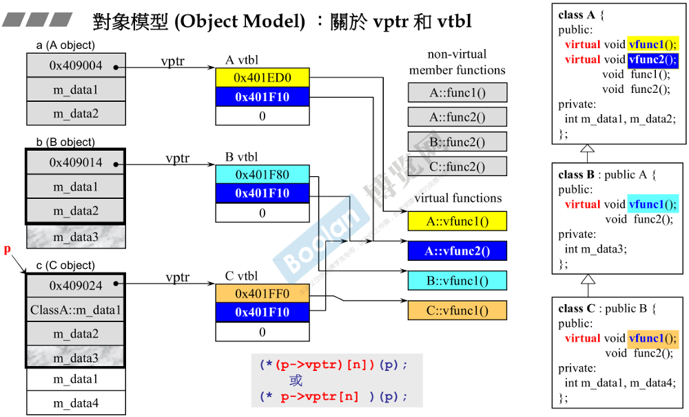
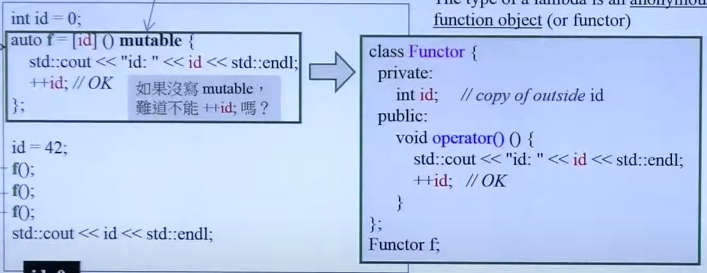

[侯捷C++ Str](https://blog.csdn.net/WJwwwwwww/article/details/133605255)

[C++ 八股文](https://blog.csdn.net/m0_50816320/article/details/129326768)

[C++ 全面复习](https://github.com/selfboot/CS_Offer/tree/master/C%2B%2B)

## C++ 过程

### 编译过程：

首先是预处理阶段(preprocessing)->编译阶段(compilation)->汇编阶段(assembly)->链接阶段(linking)。

1. 预处理阶段,编译器对文件包含关系进行检查(头文件和宏)，将其作相应替换，生成.i文件; .

2. 编译阶段，将预处理的生成文件转化为汇编文件;

3. 汇编阶段,将汇编文件见转化为二进制机器码,对应后缀是.o(Linux), .obj(Windows);

4. 链接阶段，将多个目标文件及所需要的库链接成可执行文件, .out(Linux), .exe(Windows);

### Lib 和 dll

[两种内容详细介绍](https://www.cnblogs.com/wjcoding/p/11232570.html)

1. lib包含了函数所在的dll文件和文件中函数位置的信息（入口），代码由运行时加载在进程空间中的dll提供，称为动态链接库dynamic link library。**（这种方式更灵活，写的程序体积小，但是需要.exe和dll同时发布）**
2. lib包含函数代码本身，在编译时直接将代码加入程序当中，称为静态链接库static link library。**（这种方式不是很灵活，因为lib被编译到.exe中，写出的程序体积大，但是只需要发布exe即可，不需要dll文件）**

龙书中的lib 文件导入方式

```C++
#pragma comment(lib,"MyLib.lib")         // 导入上一步生成的lib文件
```

Dll 文件的导入与使用

```C++
#include <iostream>
#include <Windows.h>          //使用函数和某些特殊变量

using namespace std;
typedef void (*FUN)(int,int); //定义一个函数指针，确定调用函数的形参

int main()
{
 const char* dllname = "SUBDLL.dll"; // 加载.dll
 const char* funname = "mySub";      //SUMDLL.cpp中函数名称

 HMODULE hDLL = LoadLibrary(dllname); //不要问，跟着做

 if (hDLL != NULL)
 {
     FUN fp = FUN(GetProcAddress(hDLL,funname)); //继续做，不要问
     if(fp != NULL)
        {
          fp(5,4);
        }
     else 
        {
          cout << "Can not Find: " << funname << endl;
        }    
     FreeLibrary(hDLL);
 }
 else 
     cout << "Can not find: " << dllname;
  
 return 0;
}
```

如果需要让外部的变量去使用则需要：**_declspec(dllexport) 关键字**

### extern "C"

由于C++ 编译函数会将其参数一起放入函数名中，而C 语言并不会。所以在C++ 调用 C 函数的时候由于（编译过后的）函数名不同，会出现链接错误。而 extern "C" 相当于显式告诉编译器，对于包含中的头文件中的函数与变量以C方式进行编译链接而非C++。

## 关键字

### inline

**inline 函数是什么**

内联函数在被调用处进行代码展开，省去了参数压栈、栈帧开辟与回收，结果返回等，从而提高程序运行速度。

inline 函数更像是对编译器的建议，**实际上执不执行内联，由编译器敲定**。

inline函数相对宏函数有如下优点：（压栈相关[C++ 学习系列3 -- 函数压栈与出栈](http://lihuaxi.xjx100.cn/news/1439819.html?action=onClick)）

（1）内联函数相比宏函数来说，在代码展开时，会做安全检查或自动类型转换（同普通函数），而宏定义则不会（这是因为宏是在预处理阶段进行的，只会无脑替换，而内联函数替换则在编译阶段，编译器进行）。

（2）在类中声明同时定义的成员函数，自动转化为内联函数，因此内联函数可以访问类的成员变量，宏定义则不能。

（3）内联函数位于名称空间中，而宏定义不属于任何名称空间。这意味着，内联函数可以避免名称冲突问题，而宏定义可能会导致名称冲突。

**inline函数的注意事项**

（1）使用函数指针调用内联函数将会导致内联失败。也就是说，如果使用函数指针来调用内联函数，那么就需要获取inline函数的地址。如果要取得一个inline函数的地址，编译器就必须为此函数产生一个函数实体，那么就内联失败。

（2）如果函数体代码过长或者有多重循环语句，if或witch分支语句或递归时，不宜用内联。

（3）类的构造函数、析构函数和虚函数往往不是 inline 函数的最佳选择。（原因如下）

类的构造函数可能需要调用父类的构造函数，析构函数同样可能需要调用父类的析构函数，二者背后隐藏着大量的代码，不适合作为inline函数。

虚函数可以是内联函数，内联是可以修饰虚函数的，但是当虚函数表现多态性的时候不能内联。具有实际对象而不是对象的指针或引用时才会发生。

以下是 [C++ inline](https://blog.csdn.net/weixin_58368590/article/details/124765889) 内联函数的更为详细的说明

### Const

作用：

* 修饰变量，说明该变量不可以被改变；

* 修饰指针，分为指向常量的指针（pointer to const）和自身是常量的指针（常量指针，const pointer）；

* 修饰引用，指向常量的引用（reference to const），用于形参类型，即避免了拷贝，又避免了函数对值的修改；

* 修饰成员函数，说明该成员函数内不能修改成员变量。

（1）**创建一个常量**类然后**调用其函数**，如果其函数定义的时候，没有加const，那么这里函数默认的意思是可能会改变数据，与我们的常量类矛盾了，<u>编译器会报错</u>；因此，对于不会改变数据内容的函数，一定一定要加const。

（2）const 的指针与引用：

指针常量和常量指针

- 指针
  - 指向常量的指针（pointer to const）
  - 自身是常量的指针（常量指针，const pointer）
- 引用
  - 指向常量的引用（reference to const）
  - 没有 const reference，因为引用只是对象的别名，引用不是对象，不能用 const 修饰

（3）Const 是函数签名的一部分

对类而言，声明一个 const 类，只能调用const 类型的函数

### static

对于**非静态**的函数和数据：非静态的成员函数通过`this`指针来处理数据（一份函数—>多个对象）,对于静态函数来讲。

对于**静态**的函数和数据：静态函数没有`this`，不能处理一般的数据，只能处理静态的数据。（之前我在Unity 中老是出问题的原因）

局部 static 

| static 变量作用域        | 生命周期 | 作用域范围 | 初始化   |
| ------------------------ | -------- | ---------- | -------- |
| `Class` 内 `static` 变量 | 程序全部 | 全局       | 访问类前 |
| `Class` 外 `static`变量  | 程序全部 | 本模块     | 访问类前 |
| 局部`static` 变量域      | 程序全部 | 局部作用域 | 访问类前 |


### explicit

首先, C++中的explicit关键字**只能用于修饰类构造函数，该类型构造函数，而只有一个参数的构造函数，称之为 转换构造函数**, 它的作用是表明该构造函数是显示的。默认情况下是隐式的。

在默认情况下：

```C#
class Fraction {
public:
    Fraction(const Fraction& c);
    Fraction(double re, double im) : numerator(re), denominator(im) {};
    Fraction(double re) : numerator(re), denominator(0) {};
    Fraction operator+ (const Fraction& c);
    // 该转换函数与隐式的 Fraction(dobule re) 最好不要共存
    // 虽然不会报错，但有时会编译失败，例如 main 函数那种情况
    operator double() {
       return numerator / denominator;
    }
private:
 double numerator, denominator;
};

int main()
{
    Fraction f1(1,2);
    Fraction f2 = f1 + 5; //出错
}
```

如果类型的定义如上述那样，既有**隐式的**转换构造函数也有 自定义类型转换，可能会引发异常，原因是 Fraction 和 double 是双向转换的，编译器不知道是都转成 double 计算还是，都转成 Fraction 计算。

所以我们需要将上述 该函数声明成显示，当然这样，也无法进行 f1+5，除非重载 operator+

```C++
 explicit Fraction(double re) : numerator(re), denominator(0) {};
```

### volatile

```C++
#include <stdio.h>
#include <signal.h>
int flag = 0;
void handle(int signo)
{
	printf("收到一个 %d号信号\n",signo);
	flag = 1;
}
int main()
{
	signal(2,handle);//捕获2号信号
	while(!flag);
	printf("进程正常退出!\n");
	return 0;
}
```

编译器发现:我们只对flag这个变量做检测,而不做修改, 编译器直接优化,把flag的值保存在寄存器中,直接在CPU检测。所以程序无法直接退出。

```C++
volatile int flag = 0;//告知编译器,对flag变量的任何操作都必须真实的在内存中进行
```

就可以正常退出。

## C++ 四种强制转换

**static_cast**, **const_cast**, **reinterpret_cast**, **dynamic_cast**

**static_cast**：可以实现C++中内置基本数据类型之间的相互转换。例如：

* 基本类型 int -> double ，double -> int
* 派生类指针转基类指针
* void 类型指针转目标类型指针

```C++
double a = 1.0f;
int b = static_cast<double>(a);
double a = 1.999;
void *vptr = &a;
double *dptr = static_cast<double*>(vptr);
cout<<*dptr<<endl;
```

**const_cast**: 用来移除变量的const或volatile限定符。注：volatile 关键字主要是保持内存的可见性。

```C++
const int constant = 21;
const int* const_p = &constant; // *const_p = 7
int* modifier = const_cast<int*>(const_p); // *modifier = 7
```

**dynamic_cast**：只能用于含有含有虚函数的类，只能转指针或者引用。

* 运行时进行处理，处理时要进行类型检查。转换成功返回指针或者引用，失败返回null。
* 向下转换，基类指针转换为派生类指针。
* 不能用于内置变量的转换

**reinterpret_cast**：允许将任何指针转为其他任何指针类型，并不安全。用于处理无关类型之间的转换，他会产生一个新的值，这个值会有与原始参数（原数据类型）有完全相同的比特位。

static_cast 指向来自 void* 的指针保留地址，reinterpret_cast 保证只有当指针转换为不中的类型，然后使用reinterpret_cast 恢复原始类型。才可以获取到原始值。

## 指针和引用

**C+ +指针和引用的区别**

* 指针有自己的内存地址，占四个字节(32位系统)，而引用只是一个别名， 没有专门的内存地址。
* 指针可以被初始化为指向nullptr,而引|用必须指向一个已有的对象。
* 作为参数传递是，指针需要解引用(*)， 而直接修改引|用会改变原对象。
* 指针可以多级，引用最多-级。

`int *p[n]`和`int (*p)[n]`以及`int *p()`和`int (*p)()`的区别。

* *首先`int *p[n]` 表示p为指针数组。因为[ ]的优先级大于*，所以应该理解为int *(p[n])。

* `int (*p)[n]` 示p为二维数组指针。`int (*p)[10]`表示行指针，指向一行有10个元素的指针，其类型与二维数组名相同。

* `int *p()`表示p为函数,返回值类型为int*;

* `int (*p))`表示p为函数指针,函数原型int func0。注意函数指针不能++或 - -。

**值传递与应用传递：**

值传递 pass by value，传递value是把整个参数全传过去，尽量不要直接value传递 例 double r

引用传递 pass by reference，传引用相当于传指针，快，形式也漂亮 例 complex&

如果只是为了提升速度，不向改变数据，那么传const引用；这样传进去的东西，不能被修改

**在函数中创建的变量 (local 变量)，要返回**——这种情况是**不能返回引用的**；因为函数结束后函数中创建的变量就消失了，无法引用

### 面向对象特征：

**多态**

即多种状态（形态）。简单来说，我们可以将多态定义为相同样子的函数以多种形式显示的能力。

多态是以封装和继承为基础的。

C++ 多态分类及实现：

* 静态多态（Ad-hoc Polymorphism，编译期）：函数重载、运算符重载

* 动态多态（Subtype Polymorphism，运行期）：虚函数

* 参数多态性（Parametric Polymorphism，编译期）：类模板、函数模板

**继承**

虚继承用于解决多继承条件下的菱形继承问题（浪费存储空间、存在二义性）。

虚继承可以认为不是一种继承关系，而可以认为是一种组合的关系。 

虚继承一般通过**虚基类指针**和**虚基类表**实现，每个虚继承的子类都有一个虚基类指针（占用一个指针的存储空间，4字节）和虚基类表（不占用类对象的存储空间）（需要强调的是，虚基类依旧会在子类里面存在拷贝，只是仅仅最多存在一份而已，并不是不在子类里面了）；当虚继承的子类被当做父类继承时，虚基类指针也会被继承。

vbptr 指的是虚基类表指针（virtual base table pointer，也叫虚基表指针），该指针指向了一个虚基类表（virtual table），虚表中记录了虚基类与本类的偏移地址；通过偏移地址，这样就找到了虚基类成员，而虚继承也不用像普通多继承那样维持着公共基类（虚基类）的两份同样的拷贝，节省了存储空间。

### 构造函数

1. 构造函数无返回值，用于初始构造；
   initialization list(初始化列表)：推荐使用，效率高，仅构造函数能够使用，直接调用成员变量的构造函数

2. 构造函数内初始化：先调用成员变量的默认构造函数，再赋值
   declaration-声明：不分配空间，告诉编译器有这个东西，或者要用但定义在后面补上；
   definition-定义：为变量分配存储空间，还可以指定初始值，是一种特殊的声明；
   initialization-初始化：定义的同时赋值

3. 构造函数一般放在public中，放在private中将无法被外界调用用于构造。

4. 构造函数：先调用成员变量的构造函数，再调用自身的构造函数，即由内向外构造

5. 构造函数的顺序是：先父类中的成员变量，在调用父类，然后调用子类中成员，最后是子类

```C++
#include<bits/stdc++.h>
using namespace std;

class C{
public:
    C(){
        cout<<"is C"<<endl;
    }
    ~C(){
        cout<<"~ C"<<endl;
    }
};

class A{
public:
    A(){
        cout<<"is A"<<endl;
    }
    ~A(){
        cout<<"~ A"<<endl;
    }
    C c;
};

class B : public A{
public:
    B(){
        cout<<"is B"<<endl;
    }
    ~B(){
        cout<<"~ B"<<endl;
    }
};

int main(){
    cout<<"开始程序测试 "<<endl;
    //A *a = new A();
    B *b = new B();
    delete b;
    cout<<"结束程序测试 "<<endl;
}
```

运行结果：

```C++
开始程序测试 
is C
is A
is B
~ B
~ A
~ C
结束程序测试 
```

（注：构造和析构函数的执行是相反的 ）

### 操作符重载

**操作符重载** ——成员函数

```C++
...
complex& complex::operator += (const complex& r){
    return _doapl(this, r);
}
//等价，参数this默认隐藏
complex& complex::operator += (this, const complex& r){
    return _doapl(this, r);
}

c3+=c2+=c1    //先c1+c2再+c3
```

**操作符重载**——非成员函数

```C++
complex operator + (const complex& x, const complex& y){
    return complex(real(x) + real(y), imag(x) + imag(y));
}
...
c3 = c2 + c1
```

操作符重载说明：

类A ±*/… B"：操作符重载可使用成员函数/非成员函数  
"B ±*/… 类A”：需使用非成员函数

"<<“与”>>"必须使用非成员函数重载

其中为了区分 前置++ 和 后置++，成员函数的方式，使用带一个参数的重载作为后置++，没有参数的代表前置++。

```C++
// ++i
int& int::operator++() //这里返回的是一个引用形式，就是说函数返回值也可以作为一个左值使用。
{//函数本身无参，意味着是在自身空间内增加1的
  *this += 1;  // 增加
  return *this;  // 取回值
}

// i++
const int int::operator++(int) //函数返回值是一个非左值型的，与前缀形式的差别所在。
{//函数带参，说明有另外的空间开辟
  int oldValue = *this;  // 取回值
  ++(*this);  // 增加
  return oldValue;  // 返回被取回的值
}
```

### 析构函数

1. 如果类中动态分配了空间，就需要在析构函数中释放指针。

2. 析构函数：先调用自身的析构函数，再调用成员变量的析构函数，即由外向内析构；

虚析构函数是为了解决基类的指针指向派生类对象，并用基类的指针删除派生类对象。如果不这么做会产生未定义行为。

### 带指针类的拷贝构造、拷贝赋值、析构函数

类内含有指针成员变量，需要定义拷贝构造函数与拷贝赋值函数，析构函数防止内存泄漏；如果不定义基本一定会造成内存的泄露。

编译器默认的拷贝构造赋值（一个bit一个bit的复制），编译器默认的只是拷贝了指针指向的（浅拷贝），我们需要写自己的拷贝函数，和析构函数。

继承

- **public 继承（public inheritance）：** 在公有继承中，基类的 public 和 protected 成员的访问属性在子类中保持不变，子类可以访问基类的 public 成员和受保护成员，但<u>不能直接访问基类的私有成员</u>
  
  注：通过子类的对象只能访问基类的 public 成员

- **protected 继承（protected inheritance）**： 在受保护继承中，基类的 public 和 protected 成员都以 protected 身份出现在子类中，基类的private 成员仍然是私有；子类成员函数可以直接访问基类中的 public 和 protected 成员，但不能直接访问基类的 private 成员
  
  注：通过子类的对象不能直接访问基类中的任何成员

- **private 继承（private inheritance）**： 在私有继承中，基类的 public 和 protected 成员都以 private 身份出现在子类中，基类的私有成员仍然是私有；子类成员函数可以直接访问基类中的 public 和 protected 成员，但不能直接访问基类的 private 成员
  
  注：通过子类的对象不能直接访问基类中的任何成员

|              | 基类 public 成员 | 基类 protected 成员 | 基类 private 成员 |
| ------------ | ------------ | --------------- | ------------- |
| public 继承    | public 成员    | protected 成员    | 不能访问          |
| protected 继承 | protected 成员 | protected 成员    | 不能访问          |
| private 继承   | private 成员   | private 成员      | 不能访问          |

- 构造是由内而外

- 析构是由外而内

**拷贝构造函数**

（1）用类的一个对象去初始化另一个对象时；

（2）当函数的形参是类的对象时（值传递），如果是引用传递则不会调用；

（3）当函数的返回值是类的对象或引用时。

## 内存管理

（1）内存分区主要有**stack object**、**static object**、**global object**、**heap object**

* **Stack** **栈**，是存在于某作用域 (scope) 的一块内存空间：函数本身即会形成一个 `stack` 用来放置它所接收的参数，以及返回地址；在函数本体 (function body) 内声明的任何变量其所使用的内存块都取自上述 `stack`

* **Heap** **堆**，或称为 *system heap* ：是指由[操作系统](https://so.csdn.net/so/search?q=%E6%93%8D%E4%BD%9C%E7%B3%BB%E7%BB%9F&spm=1001.2101.3001.7020)提供的一块 global 内存空间，程序可动态分配 (dynamic allocated) 从中获得若干区块 (blocks)。**可以用** "new" **来动态取得**

* **静态存储区域**：内存在程序编译时就已分配好，这块内存在程序的整个运行期间都存在。例如：全局变量、static变量.

* **常量区/代码段**–可执行的代码/只读常量

**stack objects 的生命期**

`c1`便是所谓 stack object，其生命在作用域 (scope) 结束之际结束这种作用域内的 object，又称为 auto object，因为它会被“自动”清理（结束自动调用析构函数）

```C++
{
    complex c1(1,2);
}
```

**static local objects 的生命期**

若在前面加上 static 后，其会存在到整个程序结束 // 有时候会出现 //

```C++
{
    static complex c2(1,2);
}
```

**global objects 的生命期**

写在任何作用域之外的对象，其生命在整个程序结束之后才结束，你也可以把它视为一种 static object，其作用域是整个程序

```c++
...
complex c3(1,2);

int main()
{
    ...
}
```

**heap objects 的生命期**

`p`所指的便是 heap object，其生命在它被 delete 之际结束

```C++
{
    complex* p = new complex;
    ...
    delete p;
}
```

（2）类内成员函数实际上是在函数内第一个参数加上this指针进行调用，比如a.func()->func(this)；

（3）**new**：分配内存、转型、赋值

分配内存：先用一个特殊函数，按 class 的定义分配了两个 `double` 的大小

转型（忽视）

调用构造函数，赋值`(1,2)`

```C++
String* ps = new String("Hello");
//等价
String* ps;
void* mem = operator new(sizeof(String));    //分配内存，调用malloc
ps = static_cast<String*>(mem);                //转型
ps->String::String("Hello");                //构造函数
//等价
String::String(ps,"Hello");
```

（4）**delete**：析构、释放内存

```c++
String* ps = new String("Hello");
...
delete ps;
//等价
String::~String(ps);    //析构函数
operator delete(ps);    //释放内存，调用free
```

（5）变量动态分配内存空间大小：
调试模式：8+(7+2)x4+变量内存，格式：1+(7+1)+变量内存+1+调整+1；
非调试模式：8+变量内存，格式：1+变量内存+调整+1；
上调至16的倍数，最后一位一定是0，因此可借用作为分配标识，被分配为1，释放为0；

（6）数组动态分配内存空间大小：
调试模式：8+(7+2)x4+4(用于记录数组元素个数)+数组内存，格式1+(7+1)+1+数组内存+1+调整+1；
非调试模式：8+4(用于记录数组元素个数)+数组内存，格式1+1+变量内存+调整+1

（7）delete[ ]调用数组元素个数次析构函数，delete仅调用一次析构函数，因此可能因缺少调用析构函数次数导致内存泄漏

### 内存对齐

内存对齐的目的是为了提高CPU读写内存里数据的速度。现代的CPU读取内存并不是一个一个字节挨着读取。

**Sizeof 原则** https://blog.csdn.net/u011847345/article/details/110875445

pragma pack(n) 设定结构体、联合以及类成员变量以 n 字节方式对齐

### 内存分配

* malloc原理。

Malloc函数用于动态分配内存。malloc其采用内存池的方式， 先申请大块内存作为堆区，然后将堆区分为多个内存块。当用户申请内存时，直接从堆区分配一块合适的空闲块。

malloc采用隐式链表结构将堆区分成连续的、大小不-的块;同时malloc采用 显示链表结构来管理所有的空闲块，每一个空闲块记录了一个连续的、未分配的地址。

搜索空闲块最常见的算法有:首次适配，下一次适配，最佳适配。(就是操作系统中动态分区分配的算法)

●brk0)和sbrk()都是扩展堆的上界。

malloc：申请指定字节数的内存。申请到的内存中的初始值不确定。

calloc：为指定长度的对象，分配能容纳其指定个数的内存。申请到的内存的每一位（bit）都初始化为 0。

realloc：更改以前分配的内存长度（增加或减少）。当增加长度时，可能需将以前分配区的内容移到另一个足够大的区域，而新增区域内的初始值则不确定。

alloca：在栈上申请内存。程序在出栈的时候，会自动释放内存。但是需要注意的是，alloca 不具可移植性, 而且在没有传统堆栈的机器上很难实现。alloca 不宜使用在必须广泛移植的程序中。C99 中支持变长数组 (VLA)，可以用来替代 alloca。

## 对象模型（Object Model）

[](https://zhuanlan.zhihu.com/p/156880783?utm_id=0)



### 虚功能

虚功能的实现：

通过指针或引用调用时体现动态多态，C++ 的虚函数主要是通过放置在对象开头的虚指针和，其指向的虚函数表去实现，实现的核心是同一个虚函数在 父类和子类的偏移一致，这是多态的关键。

虚表本质上是一个数组，存放着所有虚函数的指针。如果父类的虚函数没有被子类改写，那么子类虚函数表的指针就是父类对应的虚函数的指针;虚功能的核心是派生类与基类对应的虚函数指针在数组中的偏移一致。

 当类中有虚函数时（无论多少个），其就会多一个指针—— *vptr* 虚指针，其会指向一个 *vtbl* 虚函数表，而 *vtbl* 中有指针一一对应指向所有的虚函数。

虚指针在构造函数之后进行动态的链接虚表，如果有继承关系，那么先调用父类的构造函数，虚指针会先指向父类的虚表，然后会调用子类的构造函数，并将虚指针指向子类的虚表。

## 虚函数与多态

1. 数据从内存上去理解，函数从调用权上去理解；

2. non-virtual函数：不希望derived class重新定义(override)；有纯虚函数的类为抽象类，不可以实例化

3. virtual函数：希望derived class重新定义，且已有默认定义；

4. pure virtual函数：希望derived class必须重新定义，且没有默认定义；

```C++
...
virtual void draw() const = 0;                //pure virtual
virtual void error(const std::string& msg);    //impure virtual
int objectId() const;                        //non-virtual
...
```

**虚函数发生多态的三点要素**：

- 函数是虚函数

- 通过指针或引用调用

- 有发生向上转型（父类指针，指向子类对象）

如果不满足这三点，不会发生多态，例如：

```C++
class base()
{
public:
    virtual void Print()
    {
        std::cout << "base" << endl;
    }
}

class derive()
{
public:
    virtual void Print()
    {
        std::cout << "derive" << endl;
    }
}


int main()
{
    derive d;
    base b = d;
    b.Print();
}
```

结果是 base，如果发生多态即走虚指针、虚表、函数的过程 会输出 derive，但编译器将其解释为 直接调用 base.Print(), 并不会发生多态。

### 虚析构函数

当通过基类指针或引用删除一个派生类对象时，如果基类的析构函数没有被声明为虚函数，则调用其析构函数的时候无法释放子类对象。当我们删除一个通过基类指针指向的派生类对象时，由于基类的析构函数是虚函数，程序会首先调用派生类的析构函数，然后再调用基类的析构函数。这就确保了派生类的资源能够被正确释放。

在这种情况下，

```C++
#include<bits/stdc++.h>
using namespace std;

class Base
{
public:
    virtual ~Base()
    {
        cout<< "Base::~Base()" << endl;
    }
};

class SubClass : public Base
{
public:
    virtual ~SubClass()
    {
        /*派生类析构函数的特定实现*/
        cout << "SubClass::~SubClass()" << endl;
    }
};

int main()
{
    cout << "---------------" << endl;
    Base *testPtr = new SubClass();
    delete testPtr; //正确调用SubClass和Base的析构函数
    cout << "---------------" << endl;
    return 0;
}
```

结果：

SubClass::~SubClass()

Base::~Base()

## 智能指针

C+ +的智能指针均位于<memory>库内，有四种: **shared_ptr**、**unique_ptr**. **weak_ptr**. **auto_ptr**

C++11引入了智能指针来管理内存。有四种：

- unique_ptr：独占式指针，同一时刻只能有一个指针指向同一个对像
* shared_ptr：共享式指针，同一时刻可以有多个指针指向同一个对象

* weak_ptr：用来解决shared_ptr相互引用导致的

**unique_ptr**

由于指针或引用在离开作用域是不会调用析构函数的，但对象在离开作用域会调用析构函数。`unique_ptr`本质是一个类，将复制构造函数和赋值构造函数声明为 delete 就可以实现独占式，只允许移动构造和移动赋值。`unique_ptr`所持有的对象只能通过转移语义(move)将所有权转移到另外一个`unique_ptr`。

独占对象的所有权，由于没有引用计数，因此性能较好

通过delete 删除拷贝函数

```C++
UniquePtr(UniquePtr<T> const &) = delete;        
UniquePtr & operator=(UniquePtr<T> const &) = delete;
```

**shared_ptr**

shader_ptr 通过**引用计数**的方式来实现多个`shared_ptr`对象之间共享资源。

内部维护着原始指针和对应内存的引用计数。如果对象被引用，则计数加1,如果对象被销毁，则计数减1。如果计数为0，表示对象没有被销毁，可以释放该资源。

缺点：

* `shared_ptr`的缺点是存在循环引用的问题。

* `shared_ptr`共享对象的所有权，但性能略差

引申：C++ 智能指针的实现

```C++
#include <iostream>
#include <vector>
#include <unordered_set>

template <typename T>
class shared_ptr {
private:
    T* ptr;
    int* ref_count;
    // 释放方法为内置方法 
    void release() {
        if (ref_count) {
            --(*ref_count);
            if (*ref_count == 0) {
                delete ptr;
                delete ref_count;
            }
            ptr = nullptr;
            ref_count = nullptr;
        }
    }

public:
    // shared_ptr 
    shared_ptr() : ptr(nullptr), ref_count(nullptr) {}
    // 用初始指针,new
    shared_ptr(T* p) : ptr(p), ref_count(new int(1)) {}
    // 拷贝构造
    shared_ptr(const shared_ptr& other) : ptr(other.ptr), ref_count(other.ref_count) {
        if (ref_count) {
            ++(*ref_count);
        }
    }
    ~shared_ptr() {
        release();
    }
    shared_ptr& operator=(const shared_ptr& other) {
        if (this != &other) {
            release();
            ptr = other.ptr;
            ref_count = other.ref_count;
            if (ref_count) {
                ++(*ref_count);
            }
        }
        return *this;
    }

    T* get() const {
        return ptr;
    }

    int use_count() const {
        return ref_count ? *ref_count : 0;
    }

    void reset() {
        release();
    }

    void reset(T* p) {
        release();
        ptr = p;
        ref_count = new int(1);
    }

    T& operator*() const {
        return *ptr;
    }

    T* operator->() const {
        return ptr;
    }
};

class MyClass {
public:
    MyClass() {
        std::cout << "MyClass constructor" << std::endl;
    }
    ~MyClass() {
        std::cout << "MyClass destructor" << std::endl;
    }
    void hello() {
        std::cout << "Hello, world!" << std::endl;
    }
};

int main() {
    shared_ptr<MyClass> ptr1(new MyClass());
    shared_ptr<MyClass> ptr2 = ptr1;
    std::cout << "ptr1 use count: " << ptr1.use_count() << std::endl;
    std::cout << "ptr2 use count: " << ptr2.use_count() << std::endl;
    ptr1->hello();
    ptr2.reset();
    std::cout << "ptr1 use count: " << ptr1.use_count() << std::endl;
    std::cout << "ptr2 use count: " << ptr2.use_count() << std::endl;
    return 0;
}
```

**weak_ptr**

weak_ptr是对对象的一种弱引用，可以绑定到shared_ptr，但不会增加对象的引用计数。`weak_ptr` 本质上是为了解决shared_ptr相互引用的问题，这一点从`weak_ptr` 的初始化中就可以体现。两个指针的引用计数永远不会下降为0，从而导致死锁问题。而weak_ptr是对对象的一种弱引用，可以绑定到shared_ptr，但不会增加对象的引用计数。

由于weak_ptr 内部的成员

`weak_ptr`虽然是一个模板类，但是不能用来直接定义指向原始指针的对象。

循环引用问题：

```C++
#include <iostream>
#include <memory>
using namespace std;

class BB;

class AA
{
public:
    AA() { cout << "AA::AA() called" << endl; }
    ~AA() { cout << "AA::~AA() called" << endl; }
    weak_ptr<BB> m_bb_ptr;  //!
};

class BB
{
public:
    BB() { cout << "BB::BB() called" << endl; }
    ~BB() { cout << "BB::~BB() called" << endl; }
    shared_ptr<AA> m_aa_ptr; //!
};

int main()
{
    shared_ptr<AA> ptr_a(new AA);
    shared_ptr<BB> ptr_b(new BB);
    cout << "ptr_a use_count: " << ptr_a.use_count() << endl;
    cout << "ptr_b use_count: " << ptr_b.use_count() << endl;
    //下面两句导致了AA与BB的循环引用，结果就是AA和BB对象都不会析构
    ptr_a->m_bb_ptr = ptr_b;
    ptr_b->m_aa_ptr = ptr_a;
    cout << "ptr_a use_count: " << ptr_a.use_count() << endl;
    cout << "ptr_b use_count: " << ptr_b.use_count() << endl;
    return 0;
}
```


## 函数调用

[C++ 学习系列3 -- 函数压栈与出栈](http://lihuaxi.xjx100.cn/news/1439819.html?action=onClick)

函数调用的一个过程：

压栈：

* 当前函数的返回地址会被压入栈中，以便在函数执行完毕后返回到正确的位置。

* 在函数调用点，会发出一个调用指令（如call指令），将控制权转移到被调用函数的入口点。

* 参数压栈：函数调用时，将函数的参数按照一定的顺序压入栈中。通常，参数从右至左依次入栈。

* 保存寄存器值：在一些体系结构中，函数调用时需要保存一些寄存器的值，以便在函数执行完毕后能够恢复原始的寄存器状态。

* 帧指针与局部变量压栈：为了支持函数内的局部变量和堆栈的动态分配，通常会在栈上维护一个帧指针（frame pointer）

出栈：

* 恢复寄存器值：在一些体系结构中，函数返回时需要恢复之前保存的寄存器的值。

* 释放局部变量和帧指针：函数返回后，会释放函数内部定义的局部变量所占用的栈空间，并将帧指针恢复到上一层函数的栈帧。

* 弹出参数和返回地址：函数返回后，参数和返回地址会从栈中弹出，将控制权返回到调用函数的正确位置。

## C++ 多线程

**并行两种模式：**

* 计算密集-比如大量数据并行处理。

* 任务并行-比如游戏中不同线程处理不同任务，音频，网络，渲染。

**并行计算：**

* 同步- 计算依赖，内存依赖

* 调试困难 - 死锁、资源竞争。

* IO

### 进程与线程


为什么线程最好不要被Kill，但是Process 可以被Kill。

进程在Kill 的时候操作系统会帮我们进行`Clear` 操作包括清理分配的内存与数据。而线程比如打开一个文件，线程被Kill，而其文件资源并不会被释放。


### 多线程的问题

核心的问题在于不同线程访问的同一一个变量读取与写非原子造成。如果使得读也写变成原子操作，那么会使得多线程变成完全串行。事实上每个线程如果分开不同区间，在并行时没有必要访问全局变量。

保证线程安全的手段：

* 逻辑上避免访问公共变量

比如求解数据中元素的最大值，我们一开始先Get 到线程数量，将数组以线程数量等分，根据线程号让每一个线程写入对应的数组位置。


多线程设计原则：

* 尽量不等待。
* 尽量不要使用busy waiting,长时间等待应使用mutex,短时间等待应该使用无锁方法。
* 每个线程任务不能太少，因为启动线程任然有代价(大约等价于执行1000条指令)。
* 每个线程任务分配越均衡越好。
* 如果要使用锁，它的粒度越小越好

### STL Thread

### Yield( )

**Yield 主要用来减少忙等**
试想如果操作系统对线程(非进程)调度使用贪心策略，有一个进程有两个线程，有一个线程处理完一个事件后等待别一个线程处理使用了busy waiting。系统是单核心如果执行到busy waiting,,那么因为它一直消耗CPU资源，即使当前进程时间片段用完，再次切换回来，任然可能继续执行此线程。如此下去永远没有办法执行另一线程。
现代操作系统都不会这样调度，但是我们任然有机会做优化。当我们在开始等待之前，我们已知CPU需要运行别的线程，所以我们可以主动让出机会让OS进行一次调度切换，这就是yield()。特别建议在需要进行busy wait或是无锁编程中的等待之前进行一次yield(), 它会减少可能的等待时间。为什么mutex lock不需要?

### Volatile

Volatile影响cache吗?
答案是否定的。它本质告诉编译器，所有对这个变量的读写都使用地址，而不要对中间值使用寄存器!最难理解的一个使用是linux内核中asm volatile {}它的作用是让编译器不要对这个块里的代码进行reorder!。Volatile并不引起cache flush!

## 线程同步

线程同步是为了避免多个线程同时操作相同的数据而引发的数据不一致问题。在C++中，有下面四种线程同步的方式：

1. **互斥量（Mutex）**：互斥量是最基本的线程同步机制，它确保某一时刻只有一个线程能访问共享数据。C++中的`std::mutex`和`std::recursive_mutex`就是互斥量的实现。
2. **条件变量（Condition Variables）**：条件变量是一种更复杂的同步机制，它可以使一个线程等待某个条件成立。当条件成立时，另一个线程会通知它。C++中的`std::condition_variable`就是条件变量的实现。
3. **原子操作（Atomic Operations）**：原子操作是一种低级的线程同步机制，它可以保证一段代码的执行不会被其他线程中断。C++中的`std::atomic`就是原子操作的实现。
4. **屏障（Barrier）**：Barrier是一种同步机制，它可以使得所有线程在某一点上同步。OpenMP中的`#pragma omp barrier`就是Barrier的一个例子。

### Mutex

Mutex，全称是Mutual Exclusion，中文叫做互斥量。在C++中，它是一种同步技术，用于在并发编程中保护共享数据，防止多个线程同时访问。

在C++中，我们可以使用`std::mutex`这个类来创建一个互斥量对象。通过调用其成员函数`lock()`和`unlock()`，我们可以在一个线程中锁定和解锁互斥量。当一个线程锁定了一个互斥量，其他的线程就不能再锁定它，只能等待直到这个互斥量被解锁。

```c++
#include <thread>
#include <mutex>
#include <iostream>

std::mutex mtx; // 创建一个互斥量对象

void print_block(int n, char c) {
  mtx.lock(); // 锁定互斥量
  for (int i=0; i<n; ++i) {
    std::cout << c;
  }
  std::cout << '\n';
  mtx.unlock(); // 解锁互斥量
}

int main() {
  std::thread th1(print_block,50,'*');
  std::thread th2(print_block,50,'$');

  th1.join();
  th2.join();

  return 0;
}
```

注意： Mutex lock等待是否会占用CPU时间不会，mutex进入lock后会被挂起，mutex被释放后OS会再次唤醒，其间都不会占用CPU。但是mutex lock到挂起以及恢复都会有用户态与核心态切换，所以特别短时间的等待不建议使用mutex.它至少会有上百条指令的代价。

### Semaphore

Mutex 是0，1值，只针对1个资源，而我这个关键字可以针对n

### Condition Variable

**条件变量（Condition Variables）**：
条件变量是一种同步机制，可以让线程在某个条件为真的情况下才继续执行。条件变量通常和互斥量一起使用，以避免竞态条件。在C++中，我们使用`std::condition_variable`或`std::condition_variable_any`。

一个线程可以在条件变量上等待，直到另一个线程通知它。这通常用于当一个线程需要等待某个条件成立（例如共享数据达到某个状态）时。

这是一个简易的使用示例：

```c++
#include <iostream>
#include <condition_variable>
#include <thread>
#include <chrono>

std::condition_variable cv;
std::mutex cv_m;
int i = 0;

void waits()
{
    std::unique_lock<std::mutex> lk(cv_m);
    std::cout << "Waiting... \n";
    cv.wait(lk, []{return i == 1;});
    std::cout << "...finished waiting. i == 1\n";
}

void signals()
{
    std::this_thread::sleep_for(std::chrono::seconds(1));
    std::cout << "Notifying...\n";
    cv.notify_all();
}

int main()
{
    std::thread t1(waits), t2(waits), t3(waits), t4(signals);
    t1.join(); 
    t2.join(); 
    t3.join();
    t4.join();
    return 0;
}
```

### Barrier

(类似GPU 的Resource Barrier)

在OpenMP中，Barrier是一种同步机制，用于确保在所有线程都达到某一点后，才能继续执行下一段代码。这在并行编程中是非常有用的，特别是在处理那些需要所有线程完成其任务后才能继续的情况。

使用场景，比如有一个多线程函数，这个函数分成几个阶段，每个阶段都要求所有线程在上一个阶段完成你可以多次启动线程每次做个stage, 但是非常不优雅，而且也不高效，线程启动的代价。可以使用Barrier,它是一个屏障，所有线程都达到这里再继续执行。在些复杂的多 线程程序中它有特别的应用，通常情况是 不同的stage需要访问上一个stage全局结果引起的。(想象一 下图像处理，如果有多个效果应用，可能在第二个阶段应用的时候，它可能使用别的线程产生的结果，这时就需要所有线程都完成第一阶段，再开始第二阶段。)

### **原子操作（Atomic Operations）**：

原子操作是一种低层的同步机制，它可以保证一段代码的执行在任何情况下都不会被其他线程中断。在C++中，我们使用`std::atomic`和`std::atomic_flag`。

原子操作通常用于实现无锁数据结构和其他高级同步工具。原子类型是模板类型，我们可以使用任何基本类型作为原子类型，如`std::atomic<int>`。

(在下一块)

## 无锁编程

无锁编程是在有锁编程之后发展出来的一种新的方式与想法。核心想法，不要使用mutex,但事实上无锁编程任然需要用到锁。

`std::atomic`的底层实现一般会依赖于比较并交换（Compare-and-Swap，简称CAS）这样的原子操作。CAS是一种用于实现并发算法中的原子性读改写操作的方法。

CAS操作接受三个参数：一个内存位置V，一个预期值A和一个新值B。如果内存位置V的当前值与预期值A相匹配，那么将内存位置V的值更改为B。否则，不做任何操作。无论哪种情况，都将位置V的当前值返回。如果返回的值与预期值A相等，那么操作成功。

这种操作是原子的，意味着在完成读取和修改的整个过程中，CPU保证不会被其它的事情（例如其它的线程）打断。这就是为什么CAS操作可以用于实现无锁数据结构和其它高级同步机制。

### CAS

`Computer and swap` CAS 是一个原子操作由硬件保证原子性。

CAS中的expected事实上可以当作一张票，在时间点A,领取到-张票(通过拿到head在时间点A的值)。进行一-些操作，分配新的节点，对它赋值。在时间点B，准备写回head在A、B.之间，可能别的线程也进行了类似的操作(因为没有锁，所以多个线程都可以同时操作)，在写回时可能会出错。这时，增加一个检票的过程，如果head为我拿到的时间点A的值，说明没有人改过head,这时我可以写入，如果不一致说明有人改了。那么我们需要更新我们的票，再次尝试。

```C++
#include <bits/stdc++.h>

std::vector<int> data;
std::atomic<bool> data_ready(false);

void reader_thread()
{
    while(!data_ready.load()) // 1
    {
        std::sleep(100);
    }
    std::cout<<"The answer="<<data[0]<<"\m"; // 2
}
void writer_thread()
{
    data.push_back(42); // 3
    data_ready=true; // 4
}


int main(){
    std::thread my_thread_01(reader_thread);
    std::thread my_thread_02(writer_thread);
}
```

`atomic`强制访问顺序是由对 std::atomic<bool> 使用原子操作对操作进行强行排序。

## template 模板

https://blog.csdn.net/m0_74893211/article/details/131216773

### class template 类模板

- `T`来代替某种类型
- 使用时`classname<type1> xxx`，编译器会把`T`全部替换为`type1`

### function template 函数模板

以模板作为函数的返回值。

* 比较函数——任何类型都可以进行比较；`T`来代替某种类型

* 应用时，不需要写某种类型——编译器自己会推导

### template 模板模板参数

### variadic templates(数量不定的模板参数)（C++ 11）

## C++ 11

### 关键字

#### auto（自动推断类型）

自动类型推导 auto：在C++11之后，可以用 auto 来定义变量的类型，编译器会自动进行类型推导。

注意：不建议在任何时候都使用 auto ，而是推荐在这个变量的类型名称实在是很长或者很复杂，实在是懒得打那么多字时使用，但是我们要知道变量应该是什么类型。

#### noexcept

申明foo()不会抛出异常；

```c++
void foo() noexcept;
```

#### explicit （禁止自动隐式转换）

明确禁止编译器做自动隐式转换； C++11之前explicit只用于只有一个形参的情况，c++11开始支持多个；

```C++
Class C{
    public:
        C(const string& str){
            ......
        }
}

vector<string> vec;
for(const C& value:vec){ // 报错

}
```

#### override

这个关键字，告诉编译器你是在子类中想重载父类的同名函数，让编译器知道并帮你检查语法；

[C++11 - override关键字简要介绍_c++11 override-CSDN博客](https://blog.csdn.net/HW140701/article/details/109031359)

#### final

修饰class，表示不可以再被继承
修饰虚函数，表示子类不可以再重写它；

#### decltype

用法就是typeof(x)的含义，也就是推导出表达式的数据类型；
例如：申明模板函数的返回值、传递lambda的类型；

### ranged-base for (开始支持迭代器)

形如：

```C++
for(auto value:Container){
    // statement
}
```

注意：无法修改关联容器

### Variadic Templates （数量不定的参数模板）

### nullptr（空指针）

使用 nullptr 代替 0 或者 NULL；而 nullptr 确实是个指针，其类型为 std::nullptr_t

### Uniform Initialization （一致性初始化）

在C++11之前，一个变量或者对象的初始化可能会发生于小括号，大括号，赋值运算符。如：

```C++
vector<int> vec(3, 5); // 小括号
vector<int> vec {1, 2 ,3}; // 大括号
int a = 1; // 赋值符号
```

C++11引入一致初始化，使用大括号，在变量后面直接跟大括号，大括号中可以有任意多个元素个数，设置初值，进行初始化，如：

```c++
int values[] {1, 2, 3};
vector<int> v {2, 3, 4};
complex<double> {4.0, 3.0};
```

实际上，编译器看到 {} 就会作出一个初始化列表 `initializer_list<T>`，该列表关联到标准库提供的容器 `array<T, n>`。调用函数（通常为构造函数）完成初始化时，array中的元素会被编译器被逐一传递给函数。若用于初始化的构造函数有一个重载版本的函数参数是`initializer_list<Ｔ>`，那么｛｝中的数值就不会逐一传递，而是整包一次性传递过去。

```C++
int i;     // 未定义
int j{};   // 被初始化为默认值 0
int *p;    // 空指针
int *q;    // 被初始化为 nullptr
```

统一初始化并不会做默认的类型转化，所以请看下面的例子

```C++
int x1(5.1);    // Yes, x1 is 5
int x2 = 5.1;   // Yes, x2 is 5
int x3 {5.0};   // No, Warning
char c{9};
...
```

### =delete, =default

如果你自行定义了一个构造函数，那么编译器就不会给你一个默认的构造函数。如果你强制再加=default，就能拿到默认的构造函数。 

构造函数，拷贝构造、拷贝赋值、移动构造、移动赋值、析构都有编译器默认给你加上的函数。

=delete 是不要默认的

### Alias Template（模板别名）

```C++
template <typename T>
using Vec = std::vector<T, MyAlloc<T>>;
```

### Lambdas

**lambda == 匿名函数**

闭包 == 捕获并持有了外部作用域变量的函数。

理解C++里lambda的实现方式，对C++使用者来说很理解实现方式是非常重要的。实现声明了一个匿名类，并且采用捕获的变量进行初始化，因为语言特性的关系(值类型和值传递为主)，所以Lamba 的占用的内存大小是根据捕获的类型决定的。

C++ 11引入了Lambda表达式，使得开发人员可以更方便的创建匿名函数。

Lambdas 是一组功能的定义，他可以被临时定义在一个表达式，函数式中。

Lambdas 本身是一个函数对象

```C++
vector<int> a = {1,0,3,4,5,6,4};
std::sort(a.begin(), a.end(),
          [](int& a,int& b)->bool{return a<b;});
for(auto num:a){
    cout<<num<<"  ";
}
```

完整形式：

```C++
[capture list] (parameter list) 
(mutable,throwSpec)specifiers exception -> type { function body }
```

* `[capture list]`是捕获列表，在应用中必填。
- `(parameter list)`是参数列表，在应用中选填。

- `specifiers`是限定符，在应用中选填。

- `exception`是异常说明符，在应用中选填。

- `-> type`是返回值类型，在应用中选填。

- `{ function body }`是表达式的函数体，在应用中必填。

捕获列表有，值捕获，引用捕获，混合捕获（前两种的结合）



值捕获不会更改捕获的变量，而引用捕获会。

mutable ,其意义是可以在函数体内修改按值捕获的变量；如果不需要此操作，则可以省略此项。

```C++
int a = 10;
//未用mutable修饰
auto f1 = [a](){
    a++;    //报错
}
//使用mutable修饰
auto f2 = [a]() mutable {
    a++;    //成功
}
```

## C++ 14

### 右值引用

[左值引用与右值引用的详细解](https://blog.csdn.net/RNGWGzZs/article/details/129390305)

通常认为:

* 左值是一个表示数据的表达式(如变量名或解引用的指针)， 我们可以 获取它的地址 + 可以对它赋
  值(使用空间) ，左值可以出现赋值符号的左边，也可以出现在等号右边。

* 右值也是一个表示数据的表达式，如：字面常量、表达式返回值，函数返回值等等。右值 可以出现在赋值符号的右边 ，但是 不能出现在赋值符号的左边 ， 右值不能取地址 。

所以综上：一般认为左值的生命周期长，右值的生命周期很短

右值引用可实现转移语义（Move Sementics），它的主要目的有两个方面：

- 消除两个对象交互时不必要的对象拷贝，节省运算存储资源，提高效率。
- 能够更简洁明确地定义泛型函数。

**左值引用：**

         即常见的引用，类似 C 中的指针:  

特点：

* 只能引用左值，不能引用右值  

* 但是const左值引用 可以引用右值也可以引用左值

**右值引用:**

特点：

当要进行左值引用返回时，那如果该对象就是在函数体内创建的，出了作用域它就会销毁，但其拷贝的代价又很大。遇到这样的情况，我们应该使用右值引用。

左值引用与右值引用减少拷贝的方式是不一样的：  

左值引用是直接起作用的，就是给一个变量取别名。  

右值引用是间接起作用的，利用移动构造、移动赋值 实现的是一种资源的转移。而被转移的资源也叫做 "将亡值"。也就是出了这个作用域，就会销毁的对象。

**总结：**

* 左右值区分的最根本方法是，能否取地址，能否使用它的空间。

* 左值引用只能引用左值,右值引用只能引用右值。但是const 左值引用可以引用左值 也可以引用右值。

* 右值一定没有地址并且不能修改，但是右值引用有它自己的地址，非const可以进行修改。

* 左值引用的防拷贝方式更加直接显著。右值引用防拷贝的方式是间接的，也叫"资源转移"。

* std::move()可以将一个左值变为右值。std::forward<T>()能保持参数的原属性。

### 右值引用与移动构造函数(移动赋值函数)

该类的拷贝构造函数、赋值运算符重载函数已经通过使用左值引用传参来避免一次多余拷贝了，但是内部实现要**深拷贝**，无法避免。 这时，有人提出一个想法：是不是可以提供一个`移动构造函数`，把被拷贝者的数据移动过来，被拷贝者后边就不要了，这样就可以避免深拷贝了，如：

```C++
class Array {

public:
    Array(int size) : size_(size) {
        data = new int[size_];
    }

    // 深拷贝构造
    Array(const Array& temp_array) {
        ...
    }

    // 深拷贝赋值
    Array& operator=(const Array& temp_array) {
        ..
    }

    // 移动构造函数，可以浅拷贝
    Array(const Array& temp_array, bool move) {
        data_ = temp_array.data_;
        size_ = temp_array.size_;
        // 为防止temp_array析构时delete data，提前置空其data_
        temp_array.data_ = nullptr;
    }

    ~Array() {
        delete [] data_;
    }
public:
    int *data_;
    int size_;
};
```

这么做有2个问题：

- 不优雅，表示移动语义还需要一个额外的参数(或者其他方式)。
- 无法实现！`temp_array`是个const左值引用，无法被修改，所以`temp_array.data_ = nullptr;`这行会编译不过。当然函数参数可以改成非const：`Array(Array& temp_array, bool move){...}`，这样也有问题，由于左值引用不能接右值，`Array a = Array(Array(), true);`这种调用方式就没法用了。

可以发现左值引用真是用的很不爽，**右值引用的出现解决了这个问题**，在STL的很多容器中，都实现了以**右值引用为参数**的`移动构造函数`和`移动赋值重载函数`，或者其他函数，最常见的如std::vector的`push_back`和`emplace_back`。参数为左值引用意味着拷贝，为右值引用意味着移动。

 **实例：vector::push_back使用std::move提高性能**

```C++
// 例2：std::vector和std::string的实际例子

int main() {
    std::string str1 = "aacasxs";
    std::vector<std::string> vec;
    vec.push_back(str1); // 传统方法，copy
    vec.push_back(std::move(str1)); // 调用移动语义的push_back方法，避免拷贝，str1会失去原有值，变成空字符串
    vec.emplace_back(std::move(str1)); // emplace_back效果相同，str1会失去原有值
    vec.emplace_back("axcsddcas"); // 当然可以直接接右值
}

// std::vector方法定义

void push_back (const value_type& val);
void push_back (value_type&& val);
void emplace_back (Args&&... args);
```

在vector和string这个场景，加个`std::move`会调用到移动语义函数，避免了深拷贝。

除非设计不允许移动，STL类大都支持移动语义函数，即`可移动的`。 另外，编译器会**默认**在用户自定义的`class`和`struct`中生成移动语义函数，但前提是用户没有主动定义该类的`拷贝构造`等函数(具体规则自行百度哈)。 **因此，可移动对象在<需要拷贝且被拷贝者之后不再被需要>的场景，建议使用**`std::move`**触发移动语义，提升性能。**

所以 右值引用+移动构造 的作用跟 unique_ptr 很类似。

[一文带你详细介绍c++中的std::move函数-CSDN博客](https://blog.csdn.net/tjcwt2011/article/details/129615301)

### 完美转发

完美转发(perfect forwarding):为解决引用折叠问题,必须写-个任意参数的函数模板,并转发到其他函数.为了保证完美转发，必须使用std:forward,我们希望左值转发之后还是左值,右值转发后还是右值.

当右值引用作为参数时，虽然名义上接收的是右值，但是向下传递时，已经改变为了左值。但是我们就想让它保持原有的属性。

```C++
// C++库中给提供了一个函数转发
std::forward<type>();
```

什么是引用折叠 forward函数的原理。
引用折叠就是，如果间接创建一个引用的引用， 那么这些引用就会折叠。规则:

&& + &&->&& :右值的右值引用是右值
&& + &->& :右值的左值引用是左值
& + &&->& :左值的右值引用是左值
& + &->& :左值的左值引用是左值

```@C++
template<typename T>
T&& forward(T &param){
    return static_ cast<T&&> (param);
}
```
