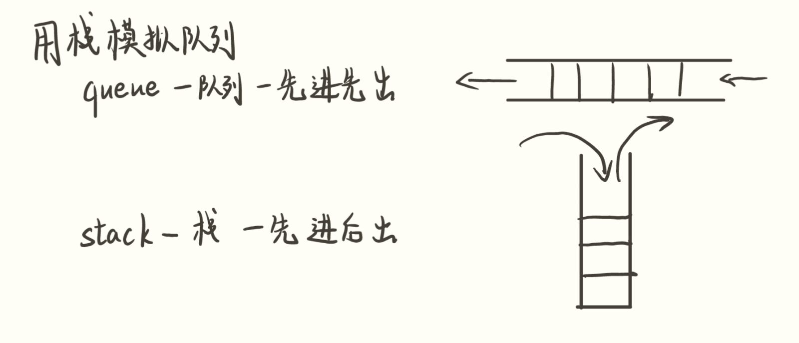
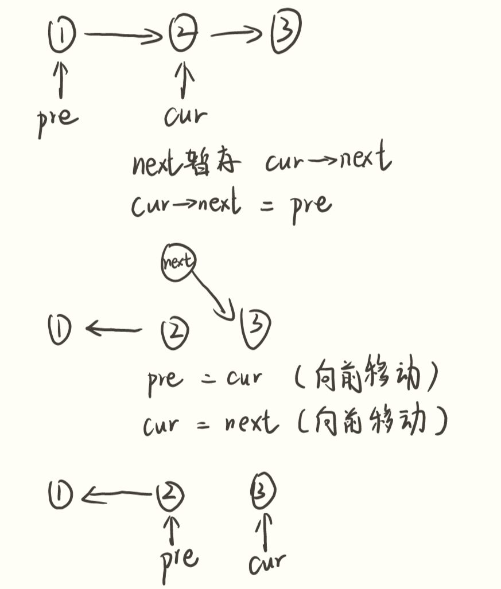
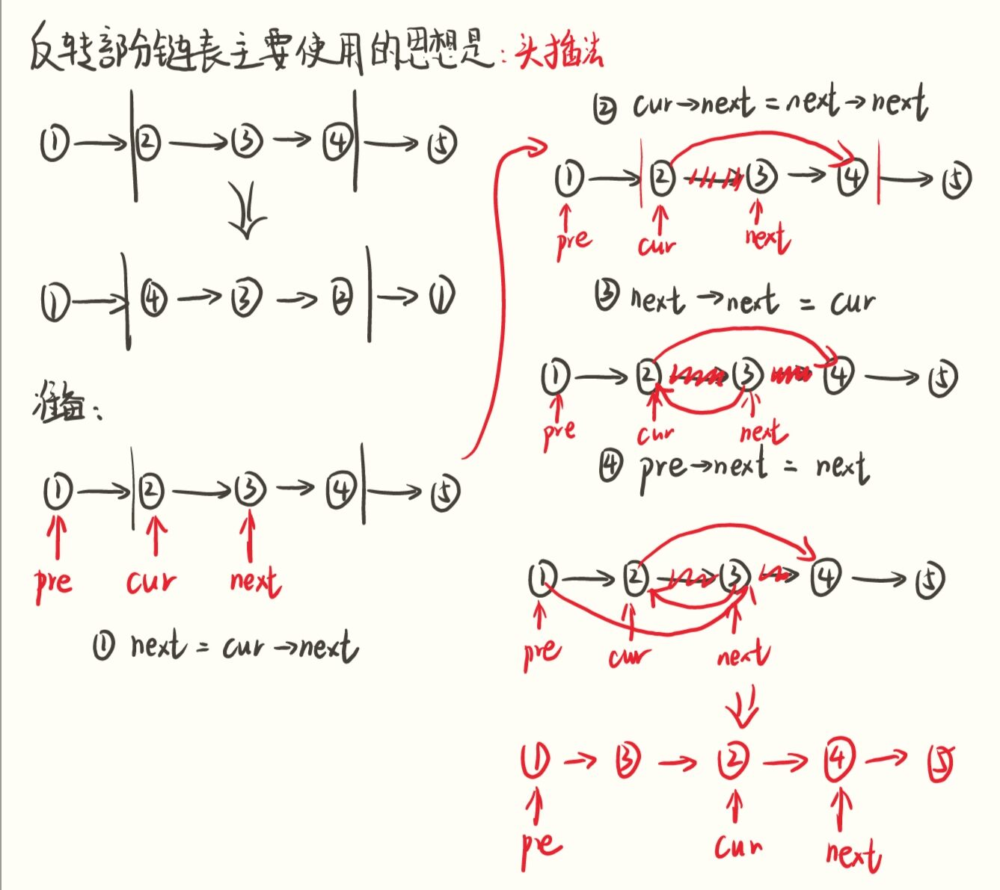

# 算法与数据结构

## 排序

排序的稳定性：比如这样一组数据：5，6，7，3，2，4，6，1。这组数据中有两个6，当经过某种排序算法排序后，这两个6的前后顺序没有发生改变。则稳定

**冒泡排序**

- 比较相邻的元素。如果第一个比第二个大，就交换它们两个；
- 对每一对相邻元素作同样的工作，从开始第一对到结尾的最后一对，这样在最后的元素就是最大的数；
- 排除最大的数，接着下一轮继续相同的操作，确定第二大的数

```C++
for(int i =0;i<arr.size();i++){
    for(int j = i;j<arr.size();j++){
        if(arr[i] > arr[j]){
            swap(arr[i],arr[j]);
        }
    }
}
```

平均时间复杂度：**O(n²)**

空间复杂度：**O(1)**

算法稳定性：稳定

**插入排序**

```C++
void InsertionSort(){
    for(int i =1;i<arr.size();i++){
        int index = i;
        int num = arr[i];
        while (index-1 >= 0 && arr[index-1] > num){
            arr[index] = arr[index-1];
            index--;
        }
        arr[index] = num;
    }
}
```

平均时间复杂度：**O(n²)**

空间复杂度：**O(1)**

算法稳定性：稳定

**快速排序**

```c++
void QuickSort(int start,int end){
    if(start >= end){
        return ;
    }
    int i = start -1,j = end +1,mid = arr[(i+j)>>1];
    while (i<j){
        do i++; while (arr[i] < mid);
        do j--; while (arr[j]> mid);
        if(i<j)
            swap(arr[i],arr[j]);
    }
    QuickSort(start,j);
    QuickSort(j+1,end);
}
```

算法复杂度：**O(nlogn)** ，最坏时间复杂度 **O(n^2)**
算法空间复杂度：**O(logn)** 
算法稳定性：不稳定

**快速排序优化策略：**

* 基点取策略： 三点取中法，随机选择方法

快速排序算法的原理，是选取一个中心值，将比它大/小的元素归为一边。三点取中和岁见选择方法可以让中心值尽量趋于中间。

* 插入排序对小数据范围进行优化

快速排序算法每次能够将序列分化为两部分，递归地进行求解。而调用函数本身需要占用空间，也耗费时间。当规模较小时，（虽然插入排序的时间复杂度为 n 平方，但小数据时插入排序的速度很快。）应该采取插入排序。

* 并行执行

由于一轮分类，都将数据分为两个部分，这两个部分彼此排序互不影响，因此可以并行地实现。

**归并排序**

```C++
void MergeSort(int l, int r)
{
    if(l >= r)
        return ;
    int mid = (l +r )>>1;
    MergeSort(l,mid);
    MergeSort(mid +1,r);

    int i = l,j = mid +1,k = 0;
    int tmp[r- l+1];
    while (i <= mid && j <= r){
        if(arr[i] <= arr[j])
            tmp[k++] = arr[i++];
        else
            tmp[k++] = arr[j++];
    }
    while (i <= mid)   tmp[k++] = arr[i++];
    while (j <= r)   tmp[k++] = arr[j++];

    for(int cnt = l;cnt <=r;cnt++){
        arr[cnt] = tmp[cnt - l];
    }
}
```

算法复杂度：**O(nlogn)** 
算法空间复杂度：**O(n)** 
算法稳定性：稳定

**堆排序**

```C++
void HeapSort(){
    int n = arr.size();
    for(int i = 0;i<n;i++){
        int Swapindex = -1;
        if(i*2 +1 < n && i*2 +2 == n)
            Swapindex = i*2 +1;
        else if(i*2 +2 < n)
            Swapindex = (arr[i*2+1] < arr[i*2+2])?i*2+1:i*2+2;

        if(Swapindex == -1){
            continue;
        }
        if(arr[Swapindex] < arr[i]){
            swap(arr[Swapindex], arr[i]);
        }
    }
    while (--n){
        int curRoot = 0,Swapindex = -1;
        swap(arr[0],arr[n]);

        if(curRoot*2 +1 < n && curRoot*2 +2 == n)
            Swapindex = curRoot*2 +1;
        else if(curRoot*2 +2 < n)
            Swapindex = (arr[curRoot*2+1] < arr[curRoot*2+2])?curRoot*2+1:curRoot*2+2;

        while (arr[Swapindex] < arr[curRoot]){
            swap(arr[Swapindex], arr[curRoot]);
            curRoot = Swapindex;
            if(curRoot*2 +1 < n && curRoot*2 +2 == n)
                Swapindex = curRoot*2 +1;
            else if(curRoot*2 +2 < n)
                Swapindex = (arr[curRoot*2+1] < arr[curRoot*2+2])?curRoot*2+1:curRoot*2+2;
        }
    }
}
```

算法复杂度：**O(nlogn)** 
算法空间复杂度：**O(1)** 
算法稳定性：不稳定

## TopK 问题

[TopK算法 排序-CSDN博客](https://blog.csdn.net/m0_37190495/article/details/79351056)

## 二分查找模版

```c++
bool check(int x) {/* ... */} // 检查x是否满足某种性质

// 区间[l, r]被划分成[l, mid]和[mid + 1, r]时使用：
int find(int l, int r)
{
    while (l < r)
    {
        int mid = l + r >> 1;
        if (check(mid)) r = mid;    // check()判断mid是否满足性质
        else l = mid + 1;
    }
    return l;
}
```

## 实际算法题

### 数组

给定一个整数数组 `nums`，将数组中的元素向右轮转 `k` 个位置，其中 `k` 是非负数。

直接数组拼接就可以了，要不然就用环形替换方法。

```
class Solution {
public:
    void rotate(vector<int>& nums, int k) {
        int n = nums.size();
        k%=n;
        vector<int> first(nums.end() - k,nums.end());
        vector<int> Last(nums.begin(),nums.end() - k);
        Last.insert(Last.begin(),first.begin(),first.end());
        nums = Last;
    }
};
```

### 二分查找

[在排序数组中查找元素的第一个和最后一个位置](https://leetcode.cn/problems/find-first-and-last-position-of-element-in-sorted-array/)

```C++
class Solution {
public:
    vector<int> searchRange(vector<int>& nums, int target) {

        vector<int> ans;
        if(nums.empty()){
            ans.push_back(-1);
            ans.push_back(-1);
            return ans;
        }
        int l = 0,r = nums.size() -1;
        while (l<r){
            int mid = (r+l)/2;
            if(nums[mid] >= target)
                r = mid;
            else
                l = mid +1 ;
        }
        if(nums[l] == target){
            ans.push_back(l);
            while (l+1 <= nums.size()-1 && nums[l+1] == target)
                l++;
            ans.push_back(l);
        }
        else{
            ans.push_back(-1);
            ans.push_back(-1);
        }
        return ans;
    }
};
```

[搜索二维矩阵](https://leetcode.cn/problems/search-a-2d-matrix/)

```C++
class Solution {
public:
    bool searchMatrix(vector<vector<int>>& matrix, int target) {
        if(matrix.empty()){
            return false;
        }
        bool ans = false;

        for(int i = 0;i<matrix.size();i++){
            if(target >= matrix[i][0] && target<= matrix[i][matrix[i].size()-1]){
                int l = 0,r = matrix[i].size() -1 ;
                while(l<r){
                    int mid = (l + r)/2;
                    if(matrix[i][mid] >= target)
                        r = mid;
                    else
                        l = mid + 1;
                }
                cout<<endl;
                ans = matrix[i][l] == target;
            }
        }
        return ans;
    }
};
```

### HasMap

C++ **hasmap** 去存储上一个两个数的位置

```C++
class Solution {
public:
    vector<int> twoSum(vector<int>& nums, int target) {
        vector<int> ans;
        unordered_map<int,int> num_Index_map;
        int n = nums.size();
        nums.reserve(n);
        for(int i =0;i<n;i++){
            // 放到这里避免
            if(num_Index_map.count(target - nums[i])>=1){
                ans.push_back(i);
                ans.push_back(num_Index_map[target - nums[i]]);
                return ans;
            }
            num_Index_map.insert(pair<int,int>(nums[i],i));
        }
        return ans;
    }
};
```

三数之和

```C++
class Solution {
public:
    vector<int> twoSum(vector<int>& nums, int target) {
        vector<int> ans;
        unordered_map<int,int> num_cnt_map;
        int n = nums.size();
        nums.reserve(n);
        for(int i =0;i<n;i++){
            if(num_cnt_map.count(target - nums[i]) >= 1){
                ans.push_back(i);
                ans.push_back(num_cnt_map[target - nums[i]]);
                return ans;
            }
            if(num_cnt_map.count(nums[i]) == 0)
                num_cnt_map.insert(pair<int,int>(nums[i], 1));
            else
                num_cnt_map[nums[i]]++;
        }
        return ans;
    }
};
```

### 栈

**用栈来实现队列**



使用两个栈，分别为1号栈和2号栈，存入元素放入1号栈中，拿取元素从2号栈中，如果2号栈中没有元素个数那么，就将此时1号栈中的元素全部放入2号栈中。

单调栈

```C++
class Solution {
public:
    vector<int> dailyTemperatures(vector<int>& temperatures) {
        stack<int> tpSt;
        int n = temperatures.size();
        vector<int> ans;
        ans.resize(n);
        for(int i =0;i<n;i++){
            if(tpSt.empty()){
                tpSt.push(i);
                continue;
            }
            while (!tpSt.empty() && temperatures[i] >  temperatures[tpSt.top()]){
                int Index = tpSt.top();
                ans[Index] = i - Index;
                tpSt.pop();
            }
            tpSt.push(i);
        }
        while (!tpSt.empty()){
            ans[tpSt.top()] = 0;
            tpSt.pop();
        }
        return ans;
    }
};
```

### 滑动窗口

[长度最小的子数组](https://leetcode.cn/problems/2VG8Kg/)

```C++
class Solution {
public:
    int minSubArrayLen(int s, vector<int>& nums) {
        int n = nums.size();
        if (n == 0) {
            return 0;
        }
        int ans = INT_MAX;
        int start = 0, end = 0;
        int sum = 0;
        while (end < n) {
            sum += nums[end];
            while (sum >= s) {
                ans = min(ans, end - start + 1);
                sum -= nums[start];
                start++;
            }
            end++;
        }
        return ans == INT_MAX ? 0 : ans;
    }
};
```

[无重复字符的最长子串](https://leetcode.cn/problems/wtcaE1/)

```C++
class Solution {
public:
    int lengthOfLongestSubstring(string s) {
        int n = s.size();
        if(n == 0)
            return 0;
        int start =0,end = 0;
        unordered_map<char,int> Count;
        int ans = -1e9;
        while (end < n){
            Count[s[end]]++;
            while (Count[s[end]] > 1){

                Count[s[start]]--;
                start++;
            }
            end++;
            ans = max(ans,end - start);
        }
        return ans;
    }
};
```

### 树

[求根节点到叶节点数字之和](https://leetcode.cn/problems/sum-root-to-leaf-numbers/)

```
class Solution {
public:
    int ans = 0;
    int sumNumbers(TreeNode* root) {
        vector<int> a;
        dfs(root,a);
        return ans;
    }

    void dfs(TreeNode* root,vector<int> &cur){
        if(root == nullptr){
            int n = cur.size();
            int sum = 0;
            for(int i =n-1;i>=0;i--){
                sum += cur[i] * pow(10,n-1-i);
            }
            cout<<sum<<endl;
            ans+=sum;
            return;
        }

        cur.push_back(root->val);
        if(root->right == nullptr && root->left == nullptr)
            dfs(root->left,cur);
        else if(root->right == nullptr && root->left != nullptr)
            dfs(root->left,cur);
        else if(root->right != nullptr && root->left == nullptr)
            dfs(root->right,cur);
        else{
            dfs(root->left,cur);
            dfs(root->right,cur);
        }
        cur.pop_back();
    }
};
```

**最近公共祖先**

```C++
class Solution {
public:
    TreeNode* ans;
    TreeNode* lowestCommonAncestor(TreeNode* root, TreeNode* p, TreeNode* q) {
        dfs(root,p,q);
        return ans;
    }

    bool dfs(TreeNode* root, TreeNode* p, TreeNode* q){
        if(root == nullptr){
            return false;
        }
        bool lson = dfs(root->left,p,q);
        bool rson = dfs(root->right,p,q);
        if(lson && rson || (root->val == p->val || root->val ==q->val)&&(lson || rson)){
            ans = root;
        }
        return lson||rson||(root->val == p->val || root->val == q->val);

    }
};
```

有序数组转二叉搜索树

```C++
class Solution {
public:
    TreeNode* sortedArrayToBST(vector<int>& nums) {
        return BST(nums,0,nums.size()-1);
    }

    TreeNode * BST(vector<int>& nums,int l,int r){
        if(l > r){
            return nullptr;
        }
        TreeNode* root = new TreeNode(nums[(l+r)/2]);
        root->left = BST(nums,l,(l+r)/2-1);
        root->right = BST(nums,(l+r)/2+1,r);
        return root;
    }
};
```

### 链表

**反转整个链表**

[反转整个链表LC](https://leetcode.cn/problems/reverse-linked-list/description/)

方法1：采用迭代办法反转整个链表

```C++
class Solution {
public:
    ListNode* reverseList(ListNode* head) {
        ListNode *pre = nullptr,*cur = head;
        while(cur != nullptr){
            ListNode* next = cur->next;
            cur->next = pre;
            pre = cur;
            cur= next;
        }
        return pre;
    }
};
```



**反转部分链表**

[力扣（LeetCode）官网-反转部分链表](https://leetcode.cn/problems/reverse-linked-list-ii/?envType=study-plan-v2&envId=top-interview-150)



**判断一个链表是否有环**

[力扣（LeetCode）官网 - 初级判断是否有环](https://leetcode.cn/problems/linked-list-cycle/?envType=study-plan-v2&envId=top-interview-150)

hasmap

```C++
While 当前结点不为 nullptr
    if 哈希表中存在当前结点
        return 存在环
    else 不存在当前结点
        将当前结点放入哈希表中
        当前结点 = 当前结点的下一节点

return 循环结束返不存在链表
```

```c++
先做一次头结点的特判

慢指针 = 头结点
快指针 = 头结点的next结点
while 慢指针 != 快指针
    if 快指针为nullptr or 快指针的next 结点
        return 不存在环
    慢指针 = 慢指针的next
    快指针 = 快指针的next的next

return 存在环
```

**删除链表的倒数第 N 个结点**

[删除链表的倒数第 N 个结点](https://leetcode.cn/problems/SLwz0R/)

### 动态规划

**爬楼梯**

f[i] = f[i-1] + f[i-2];

```C++
#include <iostream>
#include <string>
#include <vector>

using namespace std;

class Solution {
public:
    string longestPalindrome(string s) {
        int n = s.size();
        if (n < 2) {
            return s;
        }
        int maxLen = 1;
        int begin = 0;
        vector<vector<int>> dp(n, vector<int>(n));
        for (int i = 0; i < n; i++) {
            dp[i][i] = true;
        }
        for (int L = 2; L <= n; L++) {
            for (int i = 0; i < n; i++) {
                int j = L + i - 1;
                if (j >= n) {
                    break;
                }
                if (s[i] != s[j]) {
                    dp[i][j] = false;
                } else {
                    if (j - i < 3) {
                        dp[i][j] = true;
                    } else {
                        dp[i][j] = dp[i + 1][j - 1];
                    }
                }
                if (dp[i][j] && j - i + 1 > maxLen) {
                    maxLen = j - i + 1;
                    begin = i;
                }
            }
        }
        return s.substr(begin, maxLen);
    }
};
```

最长公共子序列

```C++
class Solution {
public:
    int longestCommonSubsequence(string text1, string text2) {
        int m = text1.length(), n = text2.length();
        vector<vector<int>> dp(m + 1, vector<int>(n + 1));
        for (int i = 1; i <= m; i++) {
            char c1 = text1.at(i - 1);
            for (int j = 1; j <= n; j++) {
                char c2 = text2.at(j - 1);
                if (c1 == c2) {
                    dp[i][j] = dp[i - 1][j - 1] + 1;
                } else {
                    dp[i][j] = max(dp[i - 1][j], dp[i][j - 1]);
                }
            }
        }
        return dp[m][n];
    }
};
```

### 指针

单指针做数组的交换

```C++
class Solution {
public:
    void sortColors(vector<int>& nums) {
        int n = nums.size();
        int ptr = 0;
        for(int i =0;i<n;i++){
            if(nums[i] == 0){
                swap(nums[i],nums[ptr]);
                ptr++;
            }
        }
        for(int i =0;i<n;i++){
            if(nums[i] == 1){
                swap(nums[i],nums[ptr]);
                ptr++;
            }
        }
    }
};
```

双指针

https://leetcode.cn/problems/move-zeroes/solutions/90229/dong-hua-yan-shi-283yi-dong-ling-by-wang_ni_ma/

### 堆

**堆的基本介绍**

- **最大堆** ：堆中的每一个节点的值都**大于等于**子树中所有节点的值
- **最小堆** ：堆中的每一个节点的值都**小于等于**子树中所有节点的值

**堆相关的时间复杂度**

堆的初始化时间复杂度为 `O(nlog(n))`，堆可以做到`O(1)`时间复杂度取出最大值或者最小值，`O(log(n))`时间复杂度插入或者删除数据。

**堆的建立**

建堆的过程就是一个对所有非叶节点的**自顶向下堆化**过程。

自顶向下堆化：比较这个结点下的左右子结点值，让值大的子结点和根结点交换。

**堆插入元素**

在插入元素的时候，先从底部开始插入，如果插入的元素值比父结点元素值大，则与父结点交换，一直到到比自己数值大的父结点前。（总的来说就是插入元素 ：先将元素放至数组末尾，再自底向上堆化，将末尾元素上浮）

**堆的删除元素**

删除堆定元素，将末尾元素放至堆定，再自定向下堆化，将堆顶元素下沉。

**堆排序的过程**

        利用完全二叉树性质构造的一个一维数组，用数组下标代表结点，则一个结点的左孩子下标为2i+1,右孩子为2i+2，一个结点的父节点为(i-1)/2。堆排序的思想就是，构造一个最大堆或者最小堆，以最大堆为例，那么最大的值就是根节点，把这个最大值和最后一个结点交换，然后在从前n-1个结点中构造一个最大堆，再重复上述的操作，直至最后排序结束。

堆排序的过程分为两步：

- 第一步是建堆，将一个无序的数组建立为一个堆
- 第二步是排序，将堆顶元素取出，然后对剩下的元素进行堆化，反复迭代，直到所有元素被取出为止。

[深入理解数据结构原理(4)—堆(heap)_heap数据结构-CSDN博客](https://blog.csdn.net/weixin_45754865/article/details/124826947)

### 哈希表

**哈希表的原理，如何处理冲突，如何删除元素**

哈希表是一种根据关键码值直接访问数据的数据结构，它通过把关键码值映射到表中的一个位置来访问元素，以加快查找的速度。这个映射函数叫做哈希函数；

哈希表的长度使用质数，可以降低发生冲突的概率，使哈希后的数据更加均匀，如果使用合数，可能会导致很多数据集中分布到一个点上，造成冲突；

解决冲突的办法有开放定址法和拉链法

开放定址法包括线性测探、平方测探法；线性测探法并不会真正的删除一个元素，而是做一个标记，否则可能会导致正常的查找出错一旦产生了冲突（该地址已有其它元素），就按某种规则去寻找另一空地址

拉链法是维护一个新的数组

### 合并连续区间

[力扣（LeetCode）官网 - 合并区间](https://leetcode.cn/problems/merge-intervals/)

伪代码：

```C++
对给定了不重复区间按照第一个元素做排序

for 区间i in 区间组
    startArea = 区间[i].first
    endArea = 区间[i].second
    while endArea >= 区间[i+1].first
        if 区间[i+1].second > endArea
            endArea = 区间[i+1].second
        更新i
```

### 删除序列中的特定元素

删除序列中的特定元素

使用指针帮助，对于数组内元素。如果数组内元素的值 == 目标值，nums[ptr1] = nums[i] 让指针值加一。

```C++
class Solution {
public:
    int removeElement(vector<int>& nums, int val) {
        int ptr1=0;
        int n = nums.size();
        for(int i =0;i<n;i++){
            if(nums[i] != val){
                nums[ptr1] = nums[i];
                ptr1++;
            }
        }
        return ptr1;
    }
};
```

### Top K 问题

1. 排序 nlogn

2. 部分排序 （冒泡排序前k个）kN

3. 堆排序：先把前k个元素建成小顶堆，然后将剩余元素插入小顶堆，每次将堆顶元素排除O(Nlogk）

4. 快速选择 :每次只进行 快排的一半，O(N)

[TopK算法 - 百度文库 (baidu.com)](https://wenku.baidu.com/view/49db7222cf1755270722192e453610661ed95a1a.html?_wkts_=1702865040360&bdQuery=topk%E7%AE%97%E6%B3%95)


### 杂项

**给一个数组，里面给定一系列三角形的边长，问你如何求得其中三条边构成的最大三角形周长**

做一个逆排序，然后顺序比较三条边是否满足三角形边长的条件（任意两条边大于第三条边），而且是不需要判断三次的，判断最小的两条边和最长那条边一次就行。

**给两个数，n，sum，后续给一个长度为n的数组，问你求数组中和为sum的组合数，不能有重复的组合**

动态规划问题，dp[i][j] 为考虑数组前i 个元素，组合为 j 的方案数。转移方程为：

```c++
if(p[i] <= j){
    dp[i][j] = dp[i-1][j] +dp[i-1][j-p[i]]; 
}else{//p[i]>j时只能选择不拿
    dp[i][j] = dp[i-1][j];
}
```

[数字和为sum的方法数](https://blog.csdn.net/qq_43109561/article/details/90488445)

**一个只有0和1的数组，可以将一个0变为1，求连续1的最长长度**

滑动窗口：

```C++
//
start,end // 窗口开始和结束的两根指针 start 就是 for 循环中的索引
for num in 数组
    
```

**给定一个nums数组由一些非负整数组成，现需要将他们进行排列并拼接，每个数不可拆分，使得最后的结果最大，返回值需要是string类型，否则可能会溢出**

**有1、3、5元三种硬币，问组成m元有多少种方法**

背包问题

## 场景题

**有n个硬币，已知一个是轻的给我一个天平，最少多少次找到**

**在地图上，给定一个圆的区域，想要在这个圆上投放100只怪物，如何实现能够使得这些怪物在圆里面均匀地随机分布？**

极坐标，和在正方向中撒点。两种做法。

**给一张图，有敌人、墙、空地，炸弹能放在空地上，炸该行该列没被墙挡住的敌人，问给一个炸弹最多能炸多少敌人？**
