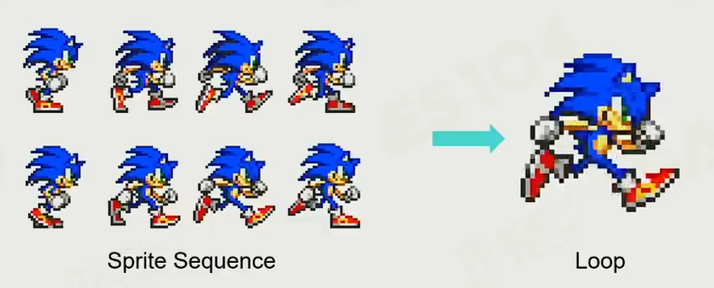
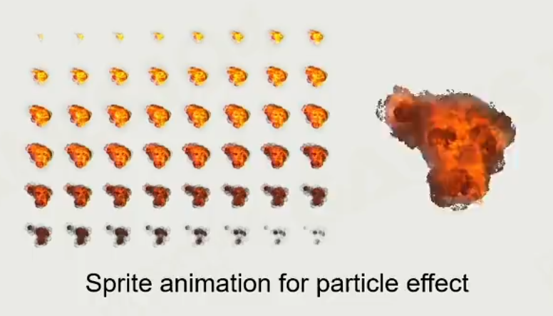
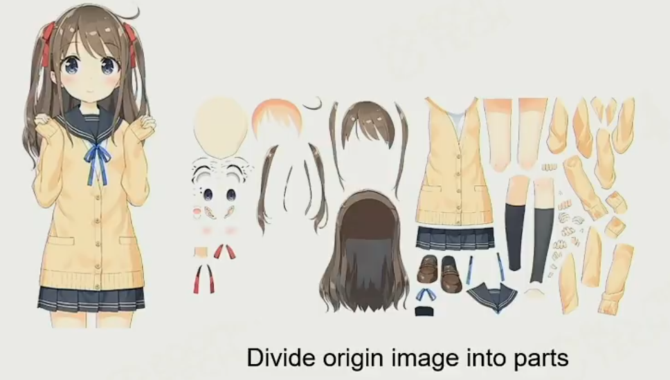
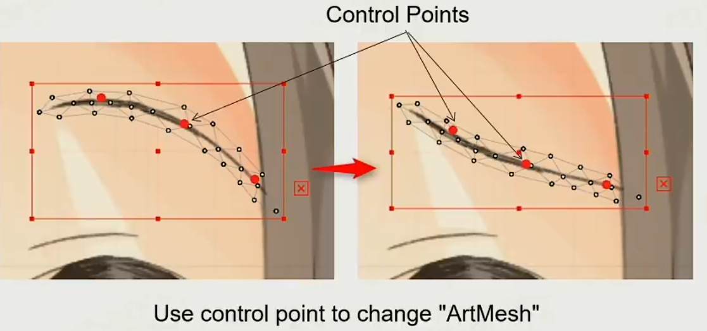
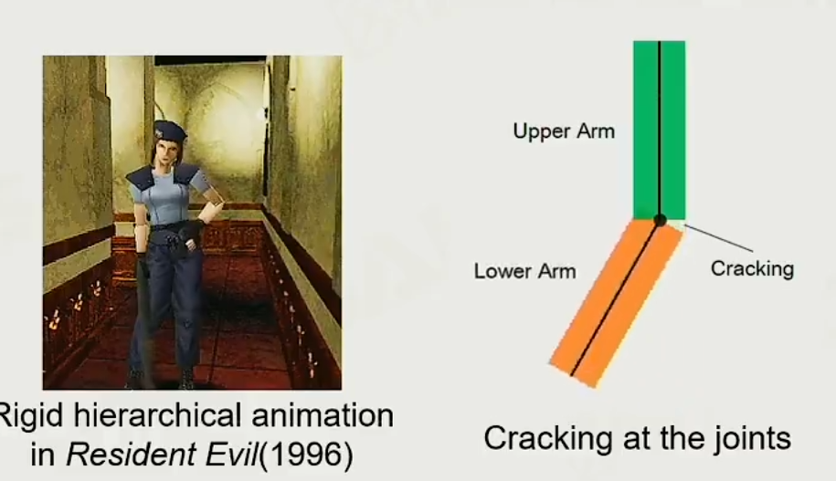
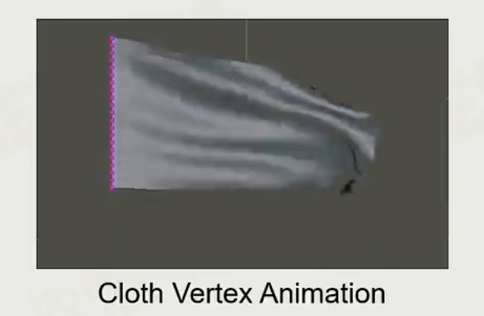
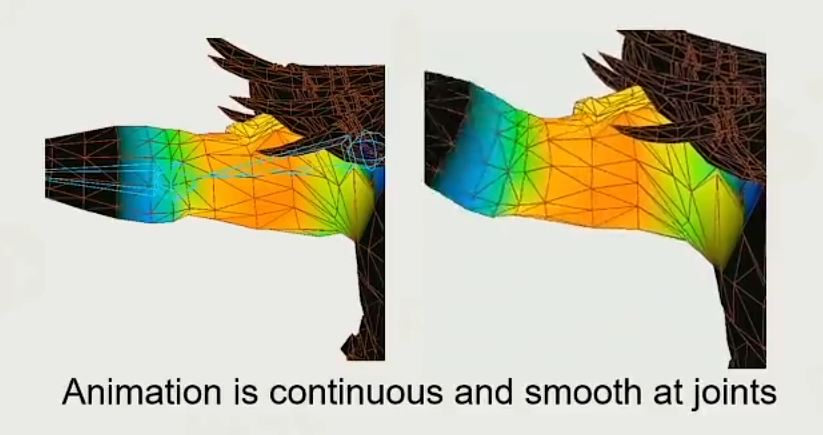
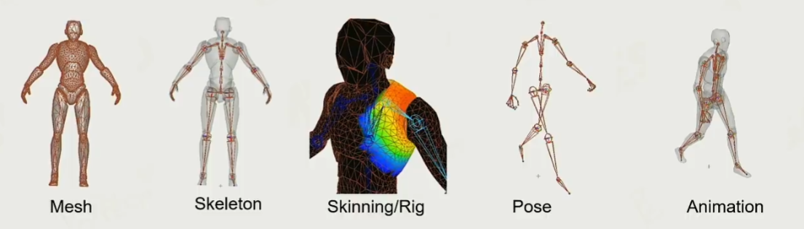

# 动画

## 最早的动画

 帧动画 与 蒙皮动画 与 骨骼动画

### 精灵动画

 帧动画的实现逻辑，`Sprite Sequence` 精灵动画序列

当前精灵动画仍然没有消失，现在还存在于特效系统中

### Live 2D 

Live 2D 直播皮套，纸片人

实现原理：把头发眼睛眉毛变成一个个小图元，把小图元拼接到一起，就变成了真正的图片，我们通过对图元的旋转，放缩，变形。变成变成动画。

图元信息：

深度

图元生成控制网格

通过关键帧来去实现动画。

### 3D 动画基础

### 关节动画

关结动画事当前骨骼动画的鼻祖，关节动画将Mesh位置数据和骨骼位置绑死，看起来像木偶，皮影一样僵硬。

### 顶点动画

基于Shader 的顶点动画

### 蒙皮动画

网格(或皮肤)被绑在骨架的关节上。

每个顶点可以加权到多个节点。

**蒙皮动画优势**

所需数据比每个顶点动画所需的数据少。

网格可以自然地被动画化(比如人类的“皮肤”)

### 蒙皮网格的实现

从制作的角度来说当我们先有`Mesh`，然后对Mesh 添加骨骼信息绑定骨骼。SKinning/Rig 是为网格刷上权重信息，在Unity 2D 骨骼绑定权重是自己计算的。

**以下是骨骼信息的讲解**

骨骼动画中有关节和骨骼两个东西完成。和每一根骨骼由一个方向和一个长度组成，头部由原点表示，尾部由尖端表示。A骨骼的尾部连接着B骨骼的头部，则称B是A的孩子结点。

骨骼的父子结点的关系为，父亲结点运动会带着子节点一起移动。而子节点移动并不会带着父节点移动。

### 蒙皮动画数学

动画计算是在其对应的空间中进行的，

`Local` 坐标系，`Model` 坐标系，`World` 坐标系

骨骼是一个树状结构，其根部是在人的尾椎部分

骨骼索引，和对应的骨骼权重。

FK （正向动力学）

FK - 由过程推导出结果。

IK（逆向动力学）

IK - 由结果推导出过程

## FK

对于一个正向动力学系统中，

* Joint（关节）：这是骨骼的头部，用来控制**旋转**。

* Links（连接）：这是骨骼的尾部，用来控制**长度**与和其它骨骼的**连接**。

* End-Effector（末端器）：这是整条骨骼的**尾部**。

* Kinematic Chain（动力学链）：这代表了**一整条彼此相连的骨骼**

## IK

逆向动力学所解决的问题是如何拟合各个骨骼以使得骨骼链的末端接近一个位置。这是一个FK的逆向操作。IK中有一个新的概念：Target

2D IK系统的**数值解法**有以下常见的几种：

* Limb Solver
* Cyclic Coordinate Descent （CCD）Solver
* Forward And Backward Reaching IK （FABRIK）Solver

### Limb Solver

Limb Solver 2D是众多IK算法中最简单的之一。它用于解**长度为****2**的IK系统，也就是说只能有两根骨骼。这也正是它的名字

Limb（肢体）的由来（手臂和腿部都可以用两根骨骼体现）。

**LimbSolver算法流程** 

1. 计算从根节点到Target的距离**d**。这是整条骨骼链的目标长度。

2. 如果**d**大于两根骨骼的长度总和**s**，那么我们无法到达Target。在这个情况下我们只需要将两个骨骼对着Target的方向排成一线即可达到最优解。

3. 如果**d**小于**s**的话，我们可以到达Target。这时我们计算出从根节点到Target这条线与根骨骼本身的夹角（使用余弦定理）和两根骨骼之间的夹角。接着我们根据这两个夹角计算出使得End Effector到达Target的一种方法。

### CCD Solver 2D

Cyclic Coordinate Descent （CCD）Solver是一种更加高级、通用的解法。CCD适用于任意长度的IK问题。它使用一种迭代的逐步逼近的方法去获得最优解的近似。

**CCD算法流程** 

1. **初始化**：算法从End Effector开始

2. **旋转**：从End Effector一步步地到根骨骼，计算每一根骨骼到End Effector和它到Target的夹角。旋转该骨骼以最小化这个夹角。

3. **检查**：如果End Effector和Target的距离已经够近了，结束算法。

4. 迭代：如果没有通过检查，则再迭代一遍。如果已经迭代了x遍了还未通过检查，则算法自动停止。

